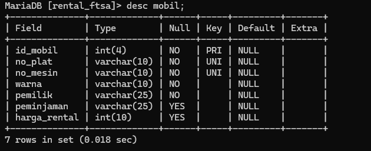
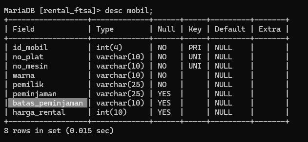
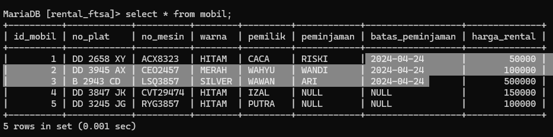
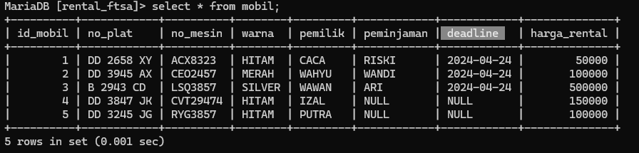
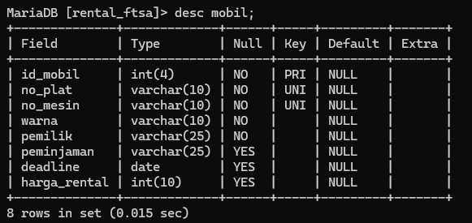
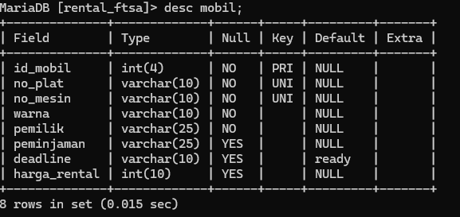
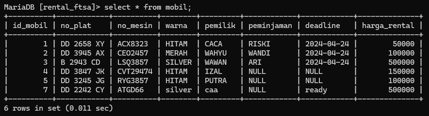
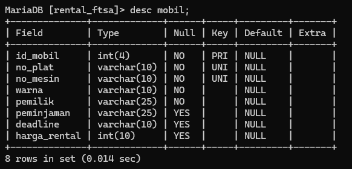
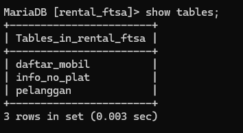

# Menambahkan Kolom
## Struktur 
```MYSQL
alter table nama_tabel add nama_kolom varchar(10) after nama_kolom;
```

## Contoh
```mysql
alter table mobil ADD batas_peminjaman varchar(10) after peminjaman;
```

## Hasil


## Analisis
- `ALTER TABLE mobil`: Ini menunjukkan bahwa Anda sedang mengubah struktur tabel bernama "mobil".
- `ADD batas_peminjaman varchar(10)`: Bagian pernyataan ini menambahkan kolom baru ke tabel "mobil". Kolom tersebut diberi nama “batas_peminjaman”, dan didefinisikan sebagai tipe data karakter variabel (string) dengan panjang maksimal 10 karakter.
- `AFTER peminjaman`: Ini menentukan posisi kolom baru relatif terhadap kolom yang ada di tabel. Dalam hal ini, kolom baru "batas_peminjaman" akan ditambahkan setelah kolom "peminjaman" yang sudah ada.

## Kesimpulan
Jadi, secara keseluruhan, pernyataan SQL ini menambahkan kolom baru bernama `"batas_peminjaman"` pada tabel `"mobil" `, dengan panjang maksimal 10 karakter, dan memposisikannya setelah kolom `"peminjaman"`.

# Tambahan update
## struktur
```mysql
UPDATE nama_table set batas_peminjaman="2024-04-24" where nama_kolom is not null;
```

## contoh
```mysql
UPDATE mobil set batas_peminjaman="2024-04-24" where peminjaman is not null;
```

## hasil


## analisis
- `UPDATE`: Ini adalah perintah SQL yang digunakan untuk memperbarui data yang ada dalam tabel. 
- `mobil`: Ini adalah nama tabel yang sedang Anda perbarui. 
- `SET batas_peminjaman="2024-04-24"`: Ini adalah bagian yang menentukan nilai baru yang akan diberikan ke kolom batas_peminjaman. Dalam hal ini, nilai yang ditetapkan adalah "2024-04-24". 
- `WHERE peminjaman is not null`: Ini adalah klausa WHERE yang digunakan untuk membatasi baris mana yang akan diperbarui. Dalam hal ini, hanya baris-baris di mana nilai kolom peminjaman tidak null yang akan diperbarui.

## kesimpulan 
Kesimpulan pada pemahaman ini bahwa tabel `mobil` memiliki kolom `batas_peminjaman` dan `peminjaman`. Perintah UPDATE digunakan untuk memodifikasi nilai dalam sebuah tabel, dan dalam kasus ini, nilai "batas_peminjaman" akan diubah menjadi `2024-04-24`.

# Mengubah Nama kolom
## Struktur
```mysql
alter table nama_table change batas_peminjaman deadline varchar(10);
``` 

## contoh
```mysql
alter table mobil change batas_peminjaman deadline varchar(10);
```

## Hasil


## Analisis
- `ALTER TABLE mobil` - Ini menandakan bahwa kita akan melakukan perubahan pada tabel `mobil`.
- `CHANGE batas_peminjaman deadline` - Ini menunjukkan bahwa kita akan mengubah nama kolom dari `batas_peminjaman` menjadi `deadline`.
- `VARCHAR(10)` - Ini adalah tipe data baru yang akan diterapkan pada kolom `deadline`. `VARCHAR(10)` berarti kolom ini dapat menyimpan string dengan panjang maksimal 10 karakter.

## Kesimpulan
setelah menjalankan perintah ini, struktur tabel `mobil` akan berubah. Kolom `batas_peminjaman` akan berganti nama menjadi `deadline` dan tipe datanya akan menjadi `VARCHAR(10)`.

# Mengubah tipe data kolom
## Struktur
```mysql
alter table nama_table modify deadline date;
```

## contoh
```mysql
alter table mobil modify deadline date;
```

## Hasil


## Analisis
- `ALTER TABLE mobil` - Ini menandakan bahwa kita akan melakukan perubahan pada tabel `mobil`.
- `MODIFY deadline DATE` - Ini menunjukkan bahwa kita akan mengubah tipe data kolom `deadline` menjadi `DATE`.

## Kesimpulan
Jadi, setelah menjalankan perintah ini, struktur tabel `mobil` akan berubah. Kolom `deadline` akan tetap dengan nama yang sama, namun tipe datanya akan berubah dari `VARCHAR(10)` menjadi `DATE`.
Tipe data `DATE` digunakan untuk menyimpan informasi tanggal (tahun, bulan, hari) tanpa waktu. Hal ini cocok jika kolom `deadline` digunakan untuk menyimpan batas tanggal pengembalian mobil.

# Menambahkan constrain 
## Struktur
```mysql
alter table nama_table
alter deadline set default `ready` ;
```

## contoh
```mysql
alter table mobil
alter deadline set default `ready` ;
```

## Hasil


## Analisis
- `ALTER TABLE mobil` - Ini menandakan bahwa kita akan melakukan perubahan pada tabel `mobil`.
- `ALTER COLUMN deadline SET DEFAULT 'ready'` - Ini menunjukkan bahwa kita akan menambahkan default value pada kolom `deadline`. Nilai defaultnya adalah `'ready'`.

## Kesimpulan
Jadi, setelah menjalankan perintah ini, struktur tabel `mobil` akan berubah. Ketika data baru dimasukkan ke tabel `mobil` dan nilai untuk kolom `deadline` tidak diisi, maka secara otomatis nilai default `'ready'` akan digunakan.

# Tambahan 
## struktur
```mysql
 insert into nama_tabel
    -> (nama_kolom,nama_kolom,nama_kolom,nama_kolom,nama_kolom,nama_kolom,nama_kolom)
    -> values (nilai-1,"nilai-2","nilai-3","nilai-4","nilai-n",NULL,'nilai-1');
```

## contoh
```mysql
 insert into mobil
    -> (id_mobil,no_plat,no_mesin,warna,pemilik,peminjaman,harga_rental)
    -> values (7,"DD 2242 CY","ATGD66","silver","caa",NULL,'500000');
```

## hasil


## Analisis
- `INSERT INTO mobil` - Ini menandakan bahwa kita akan memasukkan data baru ke dalam tabel `mobil`.
- `(id_mobil, no_plat, no_mesin, warna, pemilik, peminjaman, harga_rental)` - Ini adalah daftar kolom yang akan diisi dengan nilai-nilai baru.
- `VALUES (7, "DD 2242 CY", "ATGD66", "silver", "caa", NULL, '500000')` - Ini adalah nilai-nilai yang akan dimasukkan ke dalam masing-masing kolom yang disebutkan sebelumnya.

## Kesimpulan
Jadi, dengan perintah ini, akan ditambahkan data baru ke tabel `mobil` dengan rincian:
- `id_mobil` = 7
- `no_plat` = "DD 2242 CY"
- `no_mesin` = "ATGD66"
- `warna` = "silver"
- `pemilik` = "caa"
- `peminjaman` = NULL (karena tidak ada data yang diisi)
- `harga_rental` = '500000'
Setelah perintah ini dijalankan, maka data baru tersebut akan tersimpan di dalam tabel `mobil`.

# Menghapus kolom
## Struktur
```mysql
alter table nama_table drop column deadline;
```

## contoh
```mysql
alter table mobil drop column deadline;
```

## Hasil


## Analisis
- `ALTER TABLE mobil` - Ini menandakan bahwa kita akan melakukan perubahan pada tabel `mobil`.
- `DROP COLUMN deadline` - Ini menunjukkan bahwa kita akan menghapus kolom `deadline` dari tabel `mobil`.

## Kesimpulan
Jadi, setelah menjalankan perintah ini, struktur tabel `mobil` akan berubah. Kolom `deadline` akan dihapus dari tabel tersebut.

# Mengganti nama tabel
## Struktur 
```mysql
alter table nama_table rename to nama_kolom ;
```

## contoh
```mysql
alter table mobil rename to data_mobil ;
```

## Hasil


## Analisis
- `ALTER TABLE mobil` - Ini menandakan bahwa kita akan melakukan perubahan pada tabel `mobil`.
- `RENAME TO data_mobil` - Ini menunjukkan bahwa kita akan mengubah nama tabel `mobil` menjadi `data_mobil`.

## Kesimpulan
Jadi, setelah menjalankan perintah ini, nama tabel yang sebelumnya `mobil` akan berubah menjadi `data_mobil`. Semua referensi, query, dan kode yang sebelumnya menggunakan tabel `mobil` harus diubah agar menggunakan nama baru `data_mobil`.