# Menggunakan xampp
MySQL merupakan salah satu sistem manajemen basis data SQL (_database management system/DBMS_) yang bersifat _open soruce_ dan ada juga yang berlisensi dalam beberapa kasus saat penggunaannya. Dalam installasi MySQL juga terdapat berbagai macam aplikasi yang disediakan, ada yang berupa _stand alone_ dan berupa _package_ seperti XAMPP atau WAMP pada sistem operasi Windows dan LAMPP pada sistem operasi berbasis Linux.
langkah-langkah mengakses MySQL Command Line melalui Shell XAMPP.

1. Buka XAMPP 


2. Langkah pertama sudah pasti membuka XAMPP lalu klik Start pada barisan MySQL. Jika _service_ MySQL sudah aktif akan ditandai warna hijau pada teks MySQL dan muncul Port 3306 (Port _default_ jika belum diubah konfigurasinya).


3. Pilih Shell pada bagian kanan XAMPP
    Pada bagian kanan tampilan XAMPP terdapat beberapa pilihan seperti Config, Netstat, Shell, dll. Nah untuk mengakses MySQL Command Line memalui tampilan XAMPP pilih Shell.


# Referensi vidio youtube
https://revou.co/panduan-teknis/sql-data-types

# Penggunaan awal MySQL
## Query
```
mysql -u root -p
```

## Hasil 
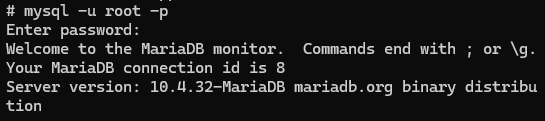

## Analisis
- `mySQL` merupakan perintah yang dgunakan untuk memulai klien MySQL di baris perintah.
- `-u root` Pengguna an root biasanya memiliki hak akses penuh ke server  MySQL dan dapat melakukan tindakan administratif.
- `-p` Ini adalah opsi yang digunakan untuk meminta kata sandi atau (passwoard) setelah perintah dijalankan.

## Kesimpulan 
perintah ini adalah kita akan masuk ke dalam command-line interface dari MySQL sebagai user `root`, dan kita akan diminta untuk memasukkan password `root` setelah menekan Enter. Jika password yang dimasukkan sesuai, maka kita akan mendapatkan akses ke command-line MySQL dengan hak akses penuh sebagai user `root`.

# Database
Database adalah sekumpulan data yang dikelola berdasarkan ketentuan tertentu yang saling berkaitan sehingga memudahkan dalam pengelolaannya. 

## Buat database
### Query 
 ```mysql
 create database [nama database]
```

### Contoh
```mysql
create database XI_RPL;
```

### hasil  
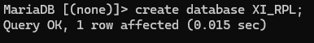

### Analisis
- `CREATE DATABASE`: Ini adalah perintah SQL untuk membuat sebuah database baru.
- `XI_RPL_1`: Ini adalah nama yang diberikan untuk database yang akan dibuat. Dalam hal ini, database tersebut akan dinamakan `XI_RPL_1`.

### Kesimpulan
perintah ini adalah kita telah berhasil membuat sebuah database baru dengan nama `XI_RPL_1` dalam sistem manajemen basis data yang sedang digunakan. Database ini akan kosong saat pertama kali dibuat, dan Anda dapat mulai membuat tabel dan memasukkan data ke dalamnya setelah database berhasil dibuat.

## Tampilkan Database
### Query
```mysql
show databases;
```

### contoh
```mysql
show databases;
```

### Hasil
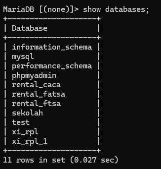

### Analisis
`show databases` : untuk menampilkan database.

### Kesimpulan
 `SHOW DATABASE` digunakan untuk menampilkan daftar database yang ada dalam sistem manejemen basis data (DBMS). Perintah ini dapat digunakan di beberapa DBMS seperti MYSQL, PostgreSQL, dan beberapa DBMS lainnya. Namun, perintahnya dapat sedikit berbeda tergantung
 
## Hapus Database
### Query
```mysql
drop database [nama_database]
```

### contoh
```mysql
drop database Xl_rpl_1;
```

### Hasil
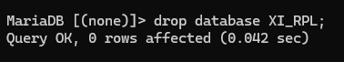

### Analisis 
`DROP DATABASE`: Ini adalah perintah yang digunakan untuk menghapus sebuah database. 
`Xl_rpl_1`: Ini adalah nama database yang akan dihapus. Dalam kasus ini, database bernama `Xl_rpl_1` akan dihapus secara permanen dari sistem.

### kesimpulan
perintah ini dijalankan, maka database `Xl_rpl_1` beserta semua tabel, data, view, prosedur tersimpan, dan objek lain yang ada di dalamnya akan dihapus tanpa kemungkinan untuk dikembalikan (kecuali jika Anda memiliki backup terakhir).

## Gunakan Database
### Query
```mysql
use [nama_database]
```

### contoh
```mysql
use xi_rpl_1;
```

### Hasil


### Analisis
`USE`: Ini adalah perintah kunci yang memberitahu MySQL bahwa Anda ingin mengganti basis data yang sedang aktif. 
`xi_rpl_1`: Ini adalah nama basis data yang ingin Anda gunakan.

### Kesimpulan
Dengan menjalankan perintah `USE xi_rpl_1;`, Anda mengubah basis data aktif dalam sesi MySQL Anda menjadi `xi_rpl_1`. Ini berguna ketika Anda ingin bekerja dengan tabel, data, dan struktur yang ada di dalam basis data `xi_rpl_1`. Pastikan basis data `xi_rpl_1` sudah ada di server MySQL Anda sebelum menjalankan perintah ini. Jika tidak, MySQL akan mengembalikan pesan kesalahan.

# Tipe data
## Angka
- `INT (Integer)1` : Digunakan untuk menyimpan bilangan bulat, seperti 1, 42, -10.
- `DECIMAL atau NUMERIC` : Digunakan untuk menyimpan angka desimal dengan presisi tertentu, seperti 3.14, 123.456.
 
## Teks
- `VARCHAR` : Digunakan untuk menyimpan teks dengan panjang variabel, seperti nama, alamat email.
- `CHAR` : Digunakan untuk menyimpan teks dengan panjang tetap, seperti kode pos.
- `TEXT` : Digunakan untuk teks panjang seperti deskripsi atau catatan.

## Tanggal dan Waktu
- `DATE`: Digunakan untuk menyimpan tanggal, seperti "2023-10-01".
- `TIME`: Digunakan untuk menyimpan waktu, seperti "15:30:00".
- `DATETIME`: Digunakan untuk menyimpan tanggal dan waktu, seperti "2023-10-01 15:30:00".

## Boolean
- `boolean dan bool` :  Digunakan untuk menyimpan nilai benar (true) atau salah (false).
   
# Tabel 
## Buat tabel

### Struktur Query
```mysql
create table [nama table](
namakolom_1 tipedata(lebar) cons,
namakolom_2 tipedata(lebar) cons,
namakolom_3 tipedata(lebar) cons,
)
```

### Contoh Query
```mysql
create table mobil(
nama_mobil varchar(15) primary key not null,
plat_mobil char(10) not null unique,
warna_mobil varchar(10) not null unique);
```

### Hasil


### Analisis
`nama_mobil varchar(15) primary key not null:`
    `nama_mobil` adalah nama kolom pertama.
    `varchar(15)` menunjukkan bahwa kolom ini memiliki tipe data VARCHAR dengan panjang maksimum 15 karakter.
    `primary key` menandakan bahwa kolom "nama_mobil" digunakan sebagai kunci utama (primary key) untuk tabel ini. Ini berarti nilainya harus unik dan tidak boleh kosong (not null).
    `not null` menunjukkan bahwa kolom "nama_mobil" tidak boleh memiliki nilai null (kosong).1. "plat_mobil char(10) not null unique":
`plat_mobil" adalah nama kolom kedua.
    `char(10)` menunjukkan bahwa kolom ini memiliki tipe data CHAR dengan panjang tetap 10 karakter.
    `not null` menunjukkan bahwa kolom "plat_mobil" tidak boleh memiliki nilai null (kosong).
    `unique` menandakan bahwa nilai dalam kolom "plat_mobil" harus unik, yaitu tidak boleh ada duplikat dalam kolom ini.
`warna_mobil varchar(10) not null unique`
    `warna_mobil` adalah nama kolom ketiga.
    `varchar(10)` menunjukkan bahwa kolom ini memiliki tipe data VARCHAR dengan panjang maksimum 10 karakter.
    `not null` menunjukkan bahwa kolom "warna_mobil" tidak boleh memiliki nilai null (kosong).
    `unique` menandakan bahwa nilai dalam kolom "warna_mobil" harus unik, yaitu tidak boleh ada duplikat dalam kolom ini.
    
### Kesimpulan 
`nama_mobil varchar(15) primary key not null`
    - `nama_mobil` adalah kolom pertama dengan tipe data VARCHAR berukuran maksimal 15 karakter.
    - Kolom ini ditetapkan sebagai kunci utama (primary key), sehingga nilai harus unik dan tidak boleh kosong (not null).
`plat_mobil char(10) not null unique`
    - `plat_mobil` adalah kolom kedua dengan tipe data CHAR berukuran tetap 10 karakter.
    - Kolom ini tidak boleh kosong (not null) dan nilai harus unik (unique).
`warna_mobil varchar(10) not null unique`  
    - `warna_mobil` adalah kolom ketiga dengan tipe data VARCHAR berukuran maksimal 10 karakter.
    - Kolom ini tidak boleh kosong (not null) dan nilai harus unik (unique).
    
## Tampilkan struktur tabel

### Contoh Query 
```mysql
show [nama_table];
 ```
 
### Contoh Query
```mysql
show tables;
```

### Hasil
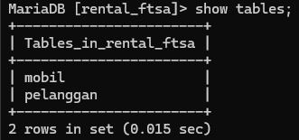

### Analisis
`show tables`: untuk menampilkan semua tabel yang ada dalam database yang sedang aktif.

### Kesimpulan
Perintah `SHOW TABLES` akan menghasilkan output berupa daftar nama-nama tabel yang tersedia dalam database yang sedang digunakan. Output ini memberikan informasi tentang tabel-tabel yang ada dalam database dan memungkinkan pengguna untuk melihat struktur dan konten data dalam tabel-tabel tersebut.

## Menampilkan Tabel

### Struktur Query
```mysql
 describe [nama table]
```

### Contoh Query
```mysql
describe mobil
```

### Hasil
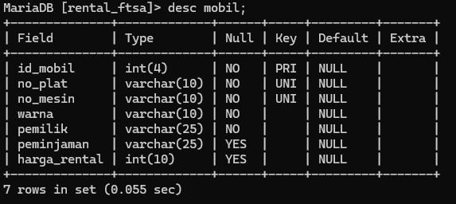

### Analisis
`describe mobil` dalam MySQL digunakan untuk menampilkan struktur dari tabel yang bernama `mobil`.

### Kesimpulan
perintah tersebut memberikan gambaran tentang bagaimana tabel "mobil" telah didefinisikan dalam basis data.

# QnA

> [! faq]- Menyapa hanya kolom id_pelanggan yang mengggunakan constraint PRIMARY KEY ?
> > Setiap pelanggan memiliki ID yang berbeda, dan tidak ada pelanggan dengan ID yang sama. Dengan menggunakan “ID Pelanggan” sebagai primary key, data pelanggan dapat diidentifikasi secara unik dan tidak ada pelanggan yang memiliki data duplikat dalam tabel.

> [! faq]- Mengapa pada kolom no_telp yang menggunakan tipe data char bukan varchar?
> >Untuk nomor telepon, yang biasanya memiliki panjang tetap, penggunaan `VARCHAR` dapat tergantung pada preferensi dan kebutuhan spesifik aplikasi atau sistem yang Anda kembangkan. Jika nomor telepon Anda cenderung bervariasi dalam panjang, `VARCHAR` mungkin menjadi pilihan yang lebih umum.

> [! faq]- Mengapa hanya kolom telp_yang menggunakan constraint UNIQUE?
> > Dalam konteks kolom telp, constraint UNIQUE berguna ketika Anda ingin memastikan bahwa nomor telepon yang diinput ke dalam basis data tidak boleh ada yang sama. Misalnya, dalam tabel pelanggan, Anda mungkin ingin memastikan bahwa setiap nomor telepon pelanggan adalah unik agar tidak ada pelanggan dengan nomor telepon yang sama.

> [! faq]- Mengapa kolom no_telp tidak memakai constraint NOT NUNLL, sementara kolom lainnya mengggunakan constraint tersebut? 
>> untuk memahami kebutuhan dan kebijakan data dalam konteks aplikasi Anda ketika memutuskan apakah akan menerapkan constraint `NOT NULL` pada kolom nomor telepon atau kolom lainnya. Jika nomor telepon harus selalu diisi dan memiliki nilai yang signifikan, maka menerapkan constraint `NOT NULL` dapat membantu mencegah data yang tidak lengkap atau tidak valid.

> [! faq]- Perbedaan PRIMARY KEY & UNIQUE?
>> PRIMARY KEY digunakan untuk mendefinisikan kunci utama tabel, memiliki keunikan dan tidak boleh NULL.UNIQUE digunakan untuk memastikan keunikan nilai tetapi dapat mengizinkan NULL values dan dapat digunakan lebih dari satu kali dalam satu tabel.

# Insert

## Insert 1 data
### Struktur
```mysql
insert into [nama_tabel]
values (nilai-1,nilai-2,nilai-n,...);
```

### Contoh
```mysql
insert into pelanggan 
values (1,"caca","adel",'0896734634'); 
```

### Hasil
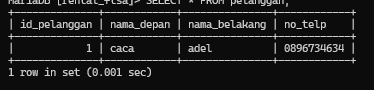

### Analisis
`INSERT INTO pelanggan`: Menunjukkan bahwa data akan dimasukkan ke dalam tabel "pelanggan".
`VALUES (1, "caca", "adel", '0896734634')`: Menunjukkan nilai-nilai yang akan dimasukkan ke dalam kolom-kolom tabel "pelanggan". Urutan nilai-nilai tersebut harus sesuai dengan urutan kolom dalam tabel.

### Kesimpulan
kesimpulan dari perintah tersebut adalah: Perintah ini menambahkan satu entri baru ke dalam `tabel "pelanggan"` dengan detail `id pelanggan 1, nama depan "caca", nama belakang "adel", dan nomor telepon '0896734634'`.

## Insert >1 data
### Struktur 
```mysql
INSERT INTO nama_tabel
VALUES (nilai-1,nilai-2,nilai-n)
	(nilai-1,nilai-2,nilai-n)
	(nilai-1,nilai-2,nilai-n));
```

### Contoh
```mysql
insert into pelanggan
  values (5,'caca','stevani','089512549986'),
	(4,'cici','arendel','086852621793'),
	(3,'cica','vexana','0896437885645');
	```

### Hasil
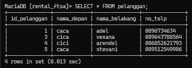

### Analisis
- `INSERT INTO nama_tabel`: Ini adalah perintah SQL yang digunakan untuk memasukkan data ke dalam sebuah tabel. `nama_tabel` harus diganti dengan nama tabel yang sesuai dalam basis data.
- `VALUES`: Ini adalah bagian yang menunjukkan nilai-nilai yang akan dimasukkan ke dalam tabel. Dalam kasus ini, kita memasukkan beberapa baris data sekaligus.
- `(5,'caca','stevani','089512549986')`: Ini adalah nilai untuk baris pertama yang akan dimasukkan. Angka 5 dimasukkan ke dalam kolom pertama (mungkin kolom ID), 'caca' ke kolom kedua, 'stevani' ke kolom ketiga, dan '089512549986' ke kolom keempat.
- `(4,'cici','arendel','086852621793')`: Ini adalah nilai untuk baris kedua yang akan dimasukkan. Angka 4 dimasukkan ke dalam kolom pertama (mungkin kolom ID), 'cici' ke kolom kedua, 'arendel' ke kolom ketiga, dan '086852621793' ke kolom keempat.
- `(3,'cica','vexana','0896437885645')`: Ini adalah nilai untuk baris ketiga yang akan dimasukkan. Angka 3 dimasukkan ke dalam kolom pertama (mungkin kolom ID), 'cica' ke kolom kedua, 'vexana' ke kolom ketiga, dan '0896437885645' ke kolom keempat.

### Kesimpulan
perintah SQL ini akan memasukkan tiga baris data sekaligus ke dalam tabel yang telah ditentukan. Ini sangat berguna ketika Anda ingin memasukkan beberapa baris data sekaligus daripada melakukan beberapa perintah `INSERT` terpisah. Pastikan untuk menyesuaikan nilai-nilai dengan struktur kolom pada tabel yang dituju, agar tidak terjadi kesalahan saat memasukkan data.

# Select

## Seluruh data
### Struktur
```mysql
select * from [nama_tabel];
```

### Contoh
```mysql
select * from pelanggan;
```

### Hasil
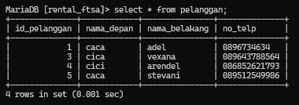

### Analisis
`SELECT *`: Menunjukkan bahwa kita ingin memilih semua kolom dalam tabel.
`FROM pelanggan`: Menunjukkan bahwa kita ingin mengambil data dari tabel `pelanggan`.

### Kesimpulan
`SELECT `: Menunjukkan bahwa kita ingin memilih semua kolom dalam tabel. `FROM` pelanggan: Menunjukkan bahwa kita ingin mengambil data dari tabel 'pelanggan'.
Jadi, perintah `SELECT * FROM pelanggan`, kita akan mengambil dan menampilkan semua data yang ada dalam tabel "pelanggan" beserta semua kolom yang dimiliki oleh tabel tersebut. Hasilnya akan berisi semua baris data dari tabel "pelanggan", dengan setiap kolom yang ditampilkan.

## Data kolom tertentu
### struktur
```mysql
select [nama_kolom1],[nama_kolom2],....,[nama_kolomn]
from [nama_tabel],
```

### contoh
```mysql
select nama_depan from pelanggan;
```

### Hasil
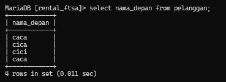

### Analisis
`SELECT nama_depan`: Menunjukkan bahwa kita ingin memilih atau menampilkan nilai dari kolom `nama_depan` dalam tabel.
`FROM pelanggan`: Menunjukkan bahwa kita ingin mengambil data dari tabel `pelanggan`.

### Kesimpulan
Perintah `SELECT nama_depan` digunakan untuk memilih atau menampilkan nilai dari kolom "nama_depan" dalam tabel. Dalam hal ini, kita hanya tertarik dengan nilai dari kolom "nama_depan" dan ingin menampilkannya.
Bagian `FROM pelanggan` digunakan untuk menunjukkan sumber data, yaitu tabel "pelanggan". Perintah ini mengindikasikan bahwa kita ingin mengambil atau mengambil data dari tabel "pelanggan".
Jadi, kesimpulannya adalah bahwa perintah SQL ini akan mengambil nilai dari kolom "nama_depan" dari setiap baris dalam tabel "pelanggan" dan menampilkannya sebagai hasil. Hasilnya akan berupa daftar nilai "nama_depan" dari semua pelanggan yang ada dalam tabel.
Perintah ini berguna jika kita hanya ingin melihat atau menganalisis nilai dari kolom tertentu dalam tabel. Dalam hal ini, kita hanya tertarik dengan kolom "nama_depan" dan menggunakan perintah ini untuk membatasi hasil hanya pada kolom yang dibutuhkan. Ini bisa sangat berguna jika tabel memiliki banyak kolom atau jika hanya beberapa kolom yang diperlukan untuk analisis atau tampilan data.

## Klausa Where
### struktur
```mysql
select [nama_kolom/] from [nama_tabel]
where [kondisi];
```

### contoh
```mysql
select nama_depan from pelanggan 
where id_pelanggan =3;
```

### Hasil
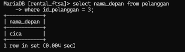

### Analisis
`SELECT nama_depan`: Perintah ini menginstruksikan database untuk mengambil nilai kolom `nama_depan` dari tabel `pelanggan`.  `FROM pelanggan`: Ini menunjukkan bahwa kita ingin mengambil data dari tabel `pelanggan`. 
`WHERE id_pelanggan = 3`: Ini adalah klausa yang digunakan untuk memberikan kondisi pada pemilihan data. Dalam hal ini, kita hanya ingin data yang memiliki nilai `id_pelanggan` sama dengan 3.

### Kesimpulan
Perintah SQL `SELECT nama_depan FROM pelanggan WHERE id_pelanggan = 3;` digunakan untuk mengambil nilai kolom `nama_depan` dari tabel `pelanggan` di mana nilai `id_pelanggan` adalah 3. Hasilnya adalah satu nilai `nama_depan` dari baris yang memenuhi kondisi tersebut.

# Update
### Struktur 
```mysql
update nama_tabel set nama_kolom where kondisi;
```

### Contoh
```mysql
update pelanggan set no_telp="0988786765"
 where id_pelanggan="5";
```

### Hasil
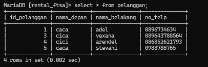

### Analisis
`UPDATE pelanggan`: Ini adalah bagian perintah yang menunjukkan bahwa data dalam tabel pelanggan akan diperbarui.
`SET no_telp="0988786765"`: Bagian ini menentukan perubahan yang akan dilakukan. Nilai kolom no_telp akan diubah menjadi "0988786765". 
`WHERE id_pelanggan="5"`: Ini adalah klausa yang menentukan baris mana yang akan diperbarui. Kondisi ini menyatakan bahwa hanya baris di mana nilai dalam kolom `id_pelanggan` adalah "5" yang akan diubah. 
	`id_pelanggan`: Nama kolom dalam tabel `pelanggan` yang diacu. 
	`=`: Operator perbandingan yang digunakan untuk memeriksa kesamaan. 
	`"5"`: Nilai yang dibandingkan. Nilai "5" diapit oleh tanda kutip ganda, menunjukkan bahwa nilai tersebut diperlakukan sebagai string.
	
### Kesimpulan
untuk memperbarui data dalam tabel bernama `pelanggan`. Lebih khususnya, pernyataan ini akan mengubah nilai kolom `no_telp` menjadi "0988786765" untuk baris di mana nilai dalam kolom `id_pelanggan` adalah "5".

# Delete/Hapus data

## delete
### Struktur
```mysql
Delete from nama_tabel where kondisi;
```

### Contoh
```mysql
delete from pelanggan where id_pelanggan= "1";
```

### Hasil


### Analisis 
`DELETE FROM pelanggan`: Bagian ini menentukan bahwa Anda ingin menghapus data dari tabel bernama "pelanggan".
`WHERE id_pelanggan = "1"`: Bagian ini adalah kondisi yang menentukan baris mana yang harus dihapus. Dinyatakan bahwa hanya baris yang nilai pada kolom "id_pelanggan" sama dengan "1" yang harus dihapus.
    - `id_pelanggan`: Ini adalah nama kolom pada tabel "pelanggan" yang direferensikan.
    - `=`: Ini adalah operator perbandingan yang digunakan untuk memeriksa kesetaraan.
    - `"1"`: Ini adalah nilai yang dibandingkan. Nilai "1" diapit tanda kutip ganda, yang menunjukkan bahwa nilai tersebut diperlakukan sebagai string.

### Kesimpulan
untuk menghapus data dari tabel bernama `pelanggan`. Hanya baris atau entri yang memenuhi kondisi tertentu yang akan dihapus, yaitu baris-baris di mana nilai dalam kolom `id_pelanggan` sama dengan "1".

## hapus data
### struktur
```mysql
drop [nama tabel]
```

### contoh
```mysql
drop table mobil;
```

### hasil
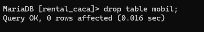

### analisis
`DROP TABLE mobil`: Menghapus tabel bernama `mobil` dari dalam database.

### kesimpulan
Perintah `DROP TABLE mobil;` digunakan untuk menghapus tabel `mobil` dari dalam database. Setelah perintah ini dijalankan, semua data yang ada dalam tabel tersebut akan dihapus, dan struktur tabel `mobil` akan dihapus dari database.
