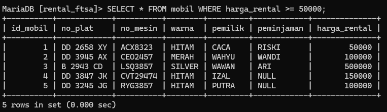
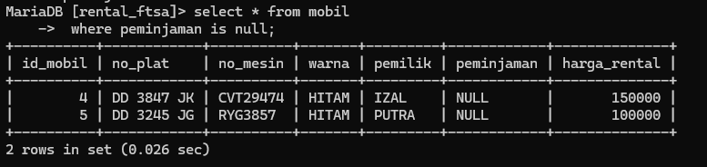
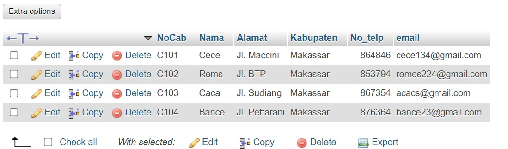
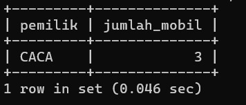

# OPERATOR LOGIKA & PEMBANDING

## AND

### Struktur
```mysql
SELECT * FROM nama_tabel WHERE nama_kolom AND nama_kolom;
```

### Contoh
```mysql
 select * from mobil where warna="Hitam" AND pemilik="caca";
```

### Hasil


### Analisis
- `SELECT *`: Ini adalah pernyataan yang digunakan untuk mengambil semua kolom dari tabel yang ditentukan.    
- `FROM mobil`: Ini menyatakan bahwa kita akan mengambil data dari tabel yang disebut "mobil". "mobil" adalah nama tabel yang digunakan dalam contoh ini. Anda harus menggantinya dengan nama tabel yang sebenarnya dalam basis data Anda.    
- `WHERE`: Ini adalah klausa yang digunakan untuk menerapkan kondisi dalam seleksi data. Hanya baris-baris yang memenuhi kondisi yang akan dipilih.    
- `warna = "Hitam"`: Ini adalah kondisi pertama yang mengatakan kita hanya ingin baris-baris di mana nilai kolom "warna" sama dengan `"Hitam"`.
- `AND`: Ini digunakan untuk menggabungkan dua atau lebih kondisi. Dalam kasus ini, kita ingin menggabungkan dua kondisi, yaitu "warna = 'Hitam'" dan `"pemilik = caca".
- `pemilik = "caca"`: Ini adalah kondisi kedua yang mengatakan kita hanya ingin baris-baris di mana nilai kolom "pemilik" sama dengan `"caca"`.

### Kesimpulan
keseluruhan perintah SQL ini akan menghasilkan semua kolom dari `tabel "mobil"` di mana nilai `kolom "warna"` adalah "Hitam" dan nilai `kolom "pemilik"` adalah `"caca"`

## OR

### struktur
```mysql
SELECT * FROM nama_tabel WHERE nama_kolom OR nama_kolom;
```

### Contoh
```mysql
 select * from mobil where warna="Hitam" OR pemilik="caca";
```

### hasil 


### analisis
- `SELECT *`: Ini adalah pernyataan yang digunakan untuk mengambil semua kolom dari tabel yang ditentukan.    
- `FROM mobil`: Ini menyatakan bahwa kita akan mengambil data dari tabel yang disebut `mobil`. `mobil` adalah nama tabel yang digunakan dalam contoh ini. Anda harus menggantinya dengan nama tabel yang sebenarnya dalam basis data Anda.    
- `OR`: Ini menggabungkan dua atau lebih kondisi, dimana setidaknya salah satu kondisi tersebut harus dipenuhi agar baris data dapat dipilih.
- `warna = "Hitam"`: Ini adalah kondisi pertama yang mengatakan kita hanya ingin baris-baris di mana nilai kolom `warna` sama dengan `"Hitam"`.
- `AND`: Ini digunakan untuk menggabungkan dua atau lebih kondisi. Dalam kasus ini, kita ingin menggabungkan dua kondisi, yaitu "warna = `'Hitam'` dan `pemilik = 'caca'`.
- `pemilik = "caca"`: Ini adalah kondisi kedua yang mengatakan kita hanya ingin baris-baris di mana nilai kolom `pemilik` sama dengan "caca".

### kesimpulan
Jadi, hasil query ini bisa berupa kombinasi dari mobil-mobil yang berwarna `"Hitam"`, mobil-mobil yang dimiliki oleh `"caca"`, atau mobil-mobil yang memenuhi kedua kondisi tersebut. Semua data ini akan diambil dari tabel `mobil` sesuai dengan kondisi yang diberikan dalam perintah `WHERE`.

## BETWEEN

### struktur
```mysql
SELECT * FROM nama_tabel WHERE nama_kolom BETWEEN nilai AND nilai;
```

### Contoh
```mysql
SELECT * FROM mobil WHERE harga_rental BETWEEN 100000 AND 150000;
```

### hasil


### analisis
- `SELECT *`: Ini adalah klausa SELECT yang digunakan untuk memilih semua kolom dalam tabel "mobil". 
- Tanda `"*"` menunjukkan bahwa kita ingin mengambil semua kolom yang ada dalam tabel tersebut.
- `FROM mobil`: Ini adalah klausa FROM yang menentukan bahwa kita ingin mengambil data dari tabel "mobil". Pastikan bahwa tabel "mobil" ada dalam database yang digunakan.
- `WHERE harga_rental BETWEEN 100000 AND 150000`: Ini adalah klausa WHERE yang digunakan untuk memfilter baris-baris dalam tabel berdasarkan kriteria tertentu. Dalam hal ini, kita memfilter baris-baris berdasarkan kolom `"harga_rental"`. Kondisi BETWEEN digunakan untuk memeriksa apakah nilai harga_rental berada di antara 100.000 dan 150.000, termasuk kedua nilai tersebut.

### kesimpulan
perintah SQL tersebut akan mengambil semua kolom dari `tabel "mobil"` di mana nilai `harga_rental` berada dalam kisaran antara `100.000 dan 150.000.` Hasilnya akan berupa baris-baris data yang memenuhi kriteria tersebut.

## NOT BETWEEN

### struktur
```mysql
SELECT * FROM nama_tabel WHERE nama_kolom NOT BETWEEN nilai AND nilai;
```

### Contoh
```mysql
 SELECT * FROM mobil WHERE harga_rental NOT BETWEEN 100000 AND 150000;
```

### hasil


### analisis
- `SELECT *`: Ini adalah klausa SELECT yang digunakan untuk memilih semua kolom dalam tabel "mobil".  
- Tanda `"*"` menunjukkan bahwa kita ingin mengambil semua kolom yang ada dalam tabel tersebut.    
- `FROM mobil`: Ini adalah klausa FROM yang menentukan bahwa kita ingin mengambil data dari tabel "mobil". Pastikan bahwa tabel "mobil" ada dalam database yang digunakan.    
- `WHERE harga_rental NOT BETWEEN 100000 AND 150000`: Ini adalah klausa WHERE yang digunakan untuk memfilter baris-baris dalam tabel berdasarkan kriteria tertentu. Dalam hal ini, kita memfilter baris-baris berdasarkan kolom "harga_rental". Kondisi NOT BETWEEN digunakan untuk memeriksa apakah nilai harga_rental tidak berada di antara 100.000 dan 150.000.

### kesimpulan
 perintah SQL tersebut akan mengambil semua kolom dari `tabel "mobil"` di mana nilai `harga_rental` tidak berada dalam kisaran antara `100.000 dan 150.000`. Hasilnya akan berupa baris-baris data yang memenuhi kriteria tersebut.
 
## <=

### struktur
```mysql 
SELECT * FROM nama_tabel WHERE nama_kolom <= nilai;
```

### Contoh
```mysql
SELECT * FROM mobil WHERE harga_rental <= 50000;
```

### hasil


### analisis
- `SELECT *`: Ini adalah klausa SELECT yang digunakan untuk memilih semua kolom dalam tabel "mobil". 
- Tanda `"*"` menunjukkan bahwa kita ingin mengambil semua kolom yang ada dalam tabel tersebut.
- `FROM mobil`: Ini adalah klausa FROM yang menentukan bahwa kita ingin mengambil data dari tabel "mobil". Pastikan bahwa tabel "mobil" ada dalam database yang digunakan.    
- `WHERE harga_rental <= 50000`: Ini adalah klausa WHERE yang digunakan untuk memfilter baris-baris dalam tabel berdasarkan kriteria tertentu. Dalam hal ini, kita memfilter baris-baris berdasarkan kolom "harga_rental". 
- Kondisi `<=` digunakan untuk memeriksa apakah nilai harga_rental kurang dari atau sama dengan 50.000.

### kesimpulan
perintah SQL tersebut akan mengambil semua kolom dari tabel `"mobil"` di mana nilai `harga_rental` kurang dari atau sama dengan `50.000.` Hasilnya akan berupa baris-baris data yang memenuhi kriteria tersebut.

## >=

### struktur
```mysql
SELECT * FROM nama_tabel WHERE nama_kolom >= nilai;
```

### Contoh
```mysql
 SELECT * FROM mobil WHERE harga_rental >= 50000;
```

### hasil


### analisis
- `SELECT *`: Ini adalah klausa SELECT yang digunakan untuk memilih semua kolom dalam tabel "mobil". 
- Tanda `"*"` menunjukkan bahwa kita ingin mengambil semua kolom yang ada dalam tabel tersebut.
- `FROM mobil`: Ini adalah klausa FROM yang menentukan bahwa kita ingin mengambil data dari tabel "mobil". Pastikan bahwa tabel "mobil" ada dalam database yang digunakan.
- `WHERE harga_rental >= 50000`: Ini adalah klausa WHERE yang digunakan untuk memfilter baris-baris dalam tabel berdasarkan kriteria tertentu. Dalam hal ini, kita memfilter baris-baris berdasarkan kolom "harga_rental". 
- Kondisi `>=` digunakan untuk memeriksa apakah nilai harga_rental lebih besar dari atau sama dengan 50.000.

### kesimpulan
perintah SQL tersebut akan mengambil semua kolom dari `tabel "mobil"` di mana nilai `harga_rental` lebih besar dari atau sama dengan `50.000`. Hasilnya akan berupa baris-baris data yang memenuhi kriteria tersebut.

## <> atau !=

### struktur
```mysql
SELECT * FROM nama_tabel WHERE nama_kolom ! = nilai;
```

### Contoh
```mysql
select * from mobil where harga_rental ! = 50000;
```


### hasil


### analisis
- `SELECT *`: Ini adalah perintah untuk memilih semua kolom dari tabel yang ditentukan. 
- Dengan `*`, Anda memilih semua kolom yang ada dalam tabel.
- `FROM mobil`: Ini menunjukkan bahwa kita ingin mengambil data dari tabel bernama `mobil`.
- `WHERE harga_rental != 50000`: Bagian ini adalah klausa `WHERE` yang digunakan untuk menerapkan kondisi pada hasil query. Dalam hal ini, kita ingin hanya memilih baris di mana nilai kolom `harga_rental` tidak sama dengan `50000`. 
- Simbol `!=` menunjukkan "tidak sama dengan" dalam SQL.

### kesimpulan
Jadi, perintah `SELECT * FROM mobil WHERE harga_rental != 50000;` akan mengembalikan semua baris dari tabel `mobil` di mana nilai pada kolom `harga_rental` tidak sama dengan `50000`. Ini berarti hanya baris-baris dengan nilai `harga_rental` yang berbeda dari `50000` yang akan dimasukkan dalam hasil query.

# TANTANGAN LOGIN 

## analisis
- `SELECT`: Ini adalah klausa SQL yang digunakan untuk memilih kolom tertentu dari tabel. Dalam hal ini, kita memilih kolom `"nama"`.
- `FROM`: Ini adalah klausa SQL yang menentukan tabel dari mana data akan dipilih. Di sini, kita memilih tabel "akun".
- `WHERE`: Ini adalah klausa SQL yang digunakan untuk menetapkan kriteria untuk baris yang akan dipilih. Dalam hal ini, kita memilih baris di mana nilai kolom "nama" sama dengan "Githa".

## hasil


## kesimpulan 
Jadi, secara keseluruhan, pernyataan ini akan memilih semua nilai dalam kolom `"nama"` dari tabel `"akun"` di mana nilai kolom `"nama"` adalah `"Githa"`.

## analisis
- `SELECT`: Ini adalah klausa SQL yang digunakan untuk memilih kolom tertentu atau semua kolom dari tabel. Dalam kasus ini, tanda bintang (*) digunakan untuk memilih semua kolom.
- FROM`: Ini adalah klausa SQL yang menentukan tabel dari mana data akan dipilih. Di sini, kita memilih tabel "akun".

## hasil


## kesimpulan
Jadi, secara keseluruhan, pernyataan ini akan memilih semua kolom dari tabel `"akun"`. Ini berarti hasilnya akan berisi semua informasi yang tersedia dalam setiap baris dari tabel `"akun"`.

# IN

## IN
### struktur
```mysql
select * from nama_tabel where warna in('nilai1,nilai2);
```

### contoh
```mysql
select * from mobil where warna in('silver','merah');
```

### hasil


### analisis
- `SELECT *`: Ini adalah klausa SELECT yang digunakan untuk memilih semua kolom dalam tabel "mobil".
- Tanda `"*"` menunjukkan bahwa kita ingin mengambil semua kolom yang ada dalam tabel tersebut.
- `FROM mobil`: Ini adalah klausa FROM yang menentukan bahwa kita ingin mengambil data dari tabel "mobil". Pastikan bahwa tabel "mobil" ada dalam database yang digunakan.
- `WHERE warna IN ('silver', 'merah')`: Ini adalah klausa WHERE yang digunakan untuk memfilter baris-baris dalam tabel berdasarkan kriteria tertentu. Dalam hal ini, kita memfilter baris-baris berdasarkan kolom "warna".
- Kondisi `IN` digunakan untuk memeriksa apakah nilai warna ada dalam daftar nilai yang diberikan, yaitu 'silver' dan 'merah'.

### kesimpulan
perintah SQL tersebut akan mengambil semua kolom dari `tabel "mobil"` di mana nilai warna adalah '`silver' atau 'merah'`. Hasilnya akan berupa baris-baris data yang memenuhi kriteria tersebut, yaitu mobil dengan warna `'silver' atau 'merah'`.

## IN + AND

### struktur
```mysql
select * from nama_tabel
  -> where nama_kolom in ('nilai1','nilai2');
  -> and nama_kolom = nilai3;
```

### contoh
```mysql 
select * from mobil
  -> where warna in ('hitam','silver'),
  -> and harga_rental = 50000;
```

### hasil


###  analisis
- `SELECT `: Ini adalah klausa SELECT yang digunakan untuk memilih semua kolom dalam tabel "mobil". 
- Tanda `"*"` menunjukkan bahwa kita ingin mengambil semua kolom yang ada dalam tabel tersebut.
- `FROM mobil`: Ini adalah klausa FROM yang menentukan bahwa kita ingin mengambil data dari tabel "mobil". Pastikan bahwa tabel "mobil" ada dalam database yang digunakan. 
- `WHERE warna IN ('hitam', 'silver')`: Ini adalah klausa WHERE yang digunakan untuk memfilter baris-baris dalam tabel berdasarkan kriteria tertentu. Dalam hal ini, kita memfilter baris-baris berdasarkan kolom "warna". 
- Kondisi `IN` digunakan untuk memeriksa apakah nilai warna ada dalam daftar nilai yang diberikan, yaitu 'hitam' dan 'silver'.
- `AND harga_rental = 50000`: Ini adalah klausa WHERE tambahan yang digunakan untuk memfilter baris-baris berdasarkan kolom "harga_rental". Kondisi ini memeriksa apakah nilai harga_rental sama dengan 50000.

### kesimpulan
perintah SQL tersebut akan mengambil semua kolom dari `tabel "mobil"` untuk baris-baris yang memiliki nilai warna `'hitam' atau 'silver'` dan `harga_rental` yang sama dengan 50000. Hasilnya akan berupa baris-baris data yang memenuhi kedua kriteria tersebut.

## IN + OR

### struktur
```mysql
select * from nama_tabel
	->where nama_kolom in('nilai1','nilai2')
	->or nama_kolom = nilai3;
```

### contoh
```mysql
select * from mobil 
	->where warna in('hitam','silver')
	->or harga_rental = 50000;
```

### hasil


### analisis
- `SELECT`: Ini adalah klausa SELECT yang digunakan untuk memilih semua kolom dalam tabel "mobil". 
- Tanda `"*"` menunjukkan bahwa kita ingin mengambil semua kolom yang ada dalam tabel tersebut.
- `FROM mobil`: Ini adalah klausa FROM yang menentukan bahwa kita ingin mengambil data dari tabel "mobil". Pastikan bahwa tabel "mobil" ada dalam database yang digunakan.
- `WHERE warna IN ('hitam', 'silver')`: Ini adalah klausa WHERE yang digunakan untuk memfilter baris-baris dalam tabel berdasarkan kriteria tertentu. Dalam hal ini, kita memfilter baris-baris berdasarkan kolom "warna". 
- Kondisi `IN` digunakan untuk memeriksa apakah nilai warna ada dalam daftar nilai yang diberikan, yaitu 'hitam' dan 'silver'.
- `OR harga_rental = 50000`: Ini adalah klausa WHERE tambahan yang digunakan untuk memfilter baris-baris berdasarkan kolom "harga_rental". Kondisi ini memeriksa apakah nilai harga_rental sama dengan 50000. Karena menggunakan operator OR, baris-baris yang memenuhi salah satu kondisi akan dipilih.

### kesimpulan
perintah SQL tersebut akan mengambil semua kolom dari tabel `"mobil"` untuk baris-baris yang memiliki nilai warna `'hitam'` atau `'silver'`, atau harga_rental yang sama dengan `50000`. Hasilnya akan berupa baris-baris data yang memenuhi salah satu kondisi tersebut.

## IN+ OR + OPERATOR

### stuktur 
```mysql
SELECT * FROM nama_tabel
    WHERE nama_kolom IN("nilai-1","nilai-2","nilai-n")
    AND nama_kolom [operator pembanding] nilai;
    ```

   ```mysql
select * from nama_tabel
    -> where nama_kolom in("nilai1","nilai2")
    -> and nama_kolom < nilai3;
    ```
     
### contoh
```mysql
select * from mobil
    -> where warna in("hitam","silver")
    -> and pemilik in('caca','wawan');
    ```

```mysql
select * from mobil
    -> where warna in("hitam","silver")
    -> and harga_rental < 150000;
    ```
    
### hasil 1


### analisis
- `SELECT * FROM mobil`: Untuk memilih semua kolom (`*`) dari tabel `mobil`.
- `WHERE`: Untuk menentukan kondisi untuk memfilter baris yang akan dipilih.
- `warna IN ("hitam", "silver")`: Untuk memfilter baris yang memiliki nilai `warna` yang termasuk dalam daftar ("hitam" atau "silver").
- `AND pemilik IN ('caca', 'wawan')`:  Untk memfilter lebih lanjut baris yang memenuhi kondisi pertama, hanya menyertakan baris di mana nilai `pemilik` termasuk dalam daftar ('caca' atau 'wawan').

### kesimpulan
Perintah SQL ini mencari dan menampilkan semua baris dari tabel `mobil` yang memenuhi kedua kondisi berikut:
1. `warna` mobil harus "hitam" atau "silver".
2. `pemilik` mobil harus "caca" atau "wawan".

### hasil 2


### analisis
- `select * from mobil`: Perintah ini akan memilih semua kolom (`*`) dari tabel `mobil`.
- `where warna in("hitam", "silver")`: Kondisi ini menyaring baris-baris di tabel `mobil` di mana nilai kolom `warna` adalah "hitam" atau "silver".
- `in` adalah operator yang memeriksa apakah nilai dari kolom `warna` termasuk dalam daftar nilai yang diberikan, yaitu "hitam" dan "silver".
- `and harga_rental < 150000`: Kondisi ini menambahkan filter tambahan untuk hanya menyertakan baris di mana nilai kolom `harga_rental` kurang dari 150.000.
- `and` adalah operator logika yang menggabungkan dua kondisi, yang berarti kedua kondisi harus terpenuhi agar baris disertakan dalam hasil.

### kesimpulan
Perintah ini akan mengembalikan semua baris dari tabel `mobil` yang memenuhi dua kriteria berikut:
1. Kolom `warna` memiliki nilai "hitam" atau "silver".
2. Kolom `harga_rental` memiliki nilai kurang dari 150.000.

# LIKE
## Mencari awalan

### Struktur 
```mysql
SELECT * FROM nama_tabel
-> WHERE pemilik like 'nama%';
```

### Contoh
```mysql
SELECT * FROM mobil
-> WHERE pemilik LIKE 'w%';
```

### Hasil


### Analisis
- `SELECT * FROM mobil` : Ini akan mengambil semua kolom dari tabel mobil.
- `WHERE pemilik LIKE 'w%' `: Ini akan memfilter data hanya untuk mobil yang dimiliki oleh pemilik yang nama awalnya adalah 'w'. 
- Tanda persen `'%'` digunakan sebagai wildcard untuk mencari nama pemilik yang dimulai dengan 'w' dan mengikuti dengan karakter apapun.

### Kesimpulan
Data dari tabel mobil yang dimiliki oleh pemilik dengan nama awal `'w'`. Hasil dari query ini akan menampilkan semua kolom dari tabel mobil.

## Mencari akhiran

### Struktur
```mysql
SELECT * FROM mobil
-> WHERE pemilik LIKE '%nama';
```

### Contoh
```mysql
SELECT * FROM mobil
-> WHERE pemilik LIKE '%i';
```

### Hasil


### Analisis
- `SELECT * FROM mobil` : Ini akan mengambil semua kolom dari tabel mobil.
- `WHERE pemilik LIKE '%i' `: Ini akan memfilter data hanya untuk mobil yang dimiliki oleh pemilik yang nama terakhirnya adalah 'i' atau berisi huruf 'i'. 
- Tanda persen `'%'` digunakan sebagai wildcard untuk mencari nama pemilik yang mengakhiri dengan 'i' atau berisi huruf 'i' di mana saja.

### Kesimpulan
Query ini akan mengambil data dari tabel mobil yang dimiliki oleh pemilik dengan nama terakhir `'i'` atau berisi huruf `'i'`. Hasil dari query ini akan menampilkan semua kolom dari tabel mobil yang memenuhi.

## Mencari awalan & akhiran

### Struktur
```mysql
SELECT * FROM mobil
-> WHERE pemilik LIKE 'nama%nama';
```

### Contoh
```mysql
SELECT * FROM mobil
-> WHERE pemilik LIKE 'w%u';
```

### Hasil


### Analisis
- `SELECT * FROM mobil`: Ini adalah bagian utama dari pernyataan SQL yang mengatakan bahwa kita ingin mengambil data dari tabel `mobil`.
- `WHERE pemilik LIKE 'w%u'`:
    - `WHERE` adalah klausa yang digunakan untuk menerapkan kondisi pada baris yang akan diambil.
    - `pemilik` adalah nama kolom di tabel `mobil` yang ingin kita periksa.
    - `LIKE` adalah operator yang digunakan untuk mencocokkan pola.
    - `'w%u'` adalah pola yang kita gunakan untuk pencocokan.
        - `w` adalah karakter yang harus dimulai oleh nilai kolom `pemilik`.
        - `%` adalah wildcard yang cocok dengan nol atau lebih karakter apa pun.
        - `u` adalah karakter yang harus diakhiri oleh nilai kolom `pemilik`.
        
### Kesimpulan
tabel mobil yang dimiliki oleh pemilik dengan nama awal dimulai dengan huruf `'w'` dan nama terakhir berakhir dengan huruf `'u'`. Hasil dari query ini akan menampilkan semua kolom dari tabel mobil.

## Mencari total karakter

### Struktur
```mysql
SELECT [*/nama_kolom] FROM nama_tabel
-> WHERE nama_kolom LIKE 'inisialnama______';
```

```mysql
 SELECT * FROM nama_tabel
-> WHERE nama_kolom LIKE '______';
```

### Contoh
```mysql
SELECT * FROM mobil
-> WHERE pemilik LIKE 'w_____';
```

```mysql
 SELECT * FROM mobil
-> WHERE pemilik LIKE '______';
```

### Hasil 1


### Analisis
- `SELECT * FROM mobil`: Perintah ini akan mengambil semua kolom (`*`) dari tabel `mobil`.
- `WHERE pemilik LIKE 'w_____'`: Klausa `WHERE` digunakan untuk menyaring baris-baris dari tabel di mana nilai kolom `pemilik` cocok dengan pola yang ditentukan. 
- Di sini, pola yang diberikan adalah `'w_____'`, yang berarti mencari nilai di kolom `pemilik` yang dimulai dengan huruf 'w' dan diikuti oleh tepat lima karakter lainnya.

### Kesimpulan
Perintah pertama (`SELECT * FROM mobil WHERE pemilik LIKE 'w_____'`) akan mencari pemilik mobil yang dimulai dengan huruf 'w' dan memiliki tepat lima karakter lainnya.

### hasil 2


### Analisis
- `SELECT * FROM mobil`: Seperti sebelumnya, perintah ini akan mengambil semua kolom dari tabel "mobil".
- `WHERE pemilik LIKE '______'`: Klausa `WHERE` kembali digunakan untuk menyaring baris-baris dari tabel di mana nilai kolom "pemilik" cocok dengan pola yang ditentukan. 
- Di sini, pola yang diberikan adalah '______', yang berarti mencari nilai di kolom "pemilik" yang terdiri dari tepat enam karakter.

### Kesimpulan
Perintah kedua (`SELECT * FROM mobil WHERE pemilik LIKE '______'`) akan mencari pemilik mobil yang memiliki tepat enam karakter.

## Kombinasi

### Struktur
```mysql
SELECT * FROM nama_tabel
-> WHERE nama_kolom LIKE '____inisialakhirnama%';
```

```mysql
SELECT * FROM nama_tabel
-> WHERE nama_kolom LIKE 'inisial%';
```

### Contoh
```mysql
SELECT * FROM mobil
-> WHERE pemilik LIKE '____a%';
```

```mysql
SELECT * FROM mobil
-> WHERE pemilik LIKE 'w%';
```

### Hasil 1


### Analisis
- `SELECT * FROM mobil`: Perintah ini berarti kita ingin mengambil (select) semua kolom (`*`) dari tabel `mobil`. Dengan kata lain, kita ingin menampilkan semua data yang ada dalam tabel `mobil`.
- `WHERE pemilik LIKE '____a%'`: Bagian ini adalah klausa WHERE yang menetapkan kriteria untuk memilih data tertentu dari tabel. Dalam hal ini, kita ingin memilih baris-baris di mana nilai kolom `pemilik` dimulai dengan (tanda `%` artinya "diikuti oleh") sebuah huruf "a", tetapi sebelumnya ada empat karakter apa pun (tanda `_` artinya "karakter apa pun").

### Kesimpulan
perintah ini akan menampilkan semua data dari tabel `mobil` di mana nama pemiliknya:
- Dimulai dengan empat karakter apa pun (`____`), dan
- Diikuti oleh huruf "a" dan karakter apa pun (`a%`).

### hasil 2


### analisis
- `SELECT`: Ini adalah klausa SQL yang digunakan untuk memilih kolom tertentu atau semua kolom dari tabel. Dalam kasus ini, tanda bintang (*) digunakan untuk memilih semua kolom.
- `FROM`: Ini adalah klausa SQL yang menentukan tabel dari mana data akan dipilih. Di sini, kita memilih tabel "mobil".   
- `WHERE`: Ini adalah klausa SQL yang digunakan untuk menerapkan kondisi untuk memfilter baris yang akan dipilih. Dalam kasus ini, kondisi yang diterapkan adalah "pemilik LIKE 'w%'". Ini berarti kita hanya ingin baris di mana nilai kolom "pemilik" dimulai dengan huruf 'w'.
- `LIKE`: Ini adalah operator yang digunakan untuk mencocokkan nilai kolom dengan pola tertentu. Dalam kasus ini, 'w%' adalah pola yang digunakan, yang berarti mencocokkan nilai yang dimulai dengan huruf 'w'.

### kesimpulan
Jadi, secara keseluruhan, pernyataan ini akan memilih semua kolom dari tabel "`mobil"` di mana nilai kolom `"pemilik"` dimulai dengan huruf `'w'`.

## Not like

### Struktur
```mysql
SELECT * FROM nama_tabel WHERE nama_kolom NOT LIKE 'inisialnama%';
```

### Contoh
```mysql
SELECT * FROM mobil WHERE peminjam NOT LIKE 'w%';
```

### Hasil


### Analisis
- `SElECT * FROM mobil `: Ini akan mengambil semua kolom dari tabel mobil.
- `WHERE peminjam NOT LIKE 'W%' `: Ini akan memfilter data hanya untuk mobil yang saat ini tidak dipinjam oleh peminjam yang nama awalnya dimulai dengan huruf `'W'`. 
- Tanda persen `'%'` digunakan sebagai wildcard untuk mencari nama peminjam yang dimulai dengan huruf 'A' dan mengikuti dengan karakter apapun.
- Tanda negasi `'NOT'` digunakan untuk mengecualikan peminjam dengan nama awal yang dimulai dengan huruf `'W'`.

### Kesimpulan
Kesimpulan `SELECT * FROM mobil WHERE peminjam NOT LIKE 'W%'` adalah bahwa query tersebut akan mengembalikan semua data dari tabel "mobil" dimana nilai kolom "peminjam" tidak dimulai dengan huruf `'W'`.

# NULL & NOT NULL 

## Mencari data kosong

### struktur
```mysql
select * from nama_tabel 
 -> where nama_kolom is null;
```

### contoh
```mysql
select * from mobil 
 -> where peminjaman is null;
```

### hasil


### analisis
- `SELECT *`: Ini adalah perintah untuk memilih semua kolom dari tabel yang ditentukan.    
- `FROM mobil`: Ini adalah klausa yang menentukan tabel yang akan Anda ambil data dari, dalam hal ini, tabel `mobil`.
- `WHERE peminjaman IS NULL`: Ini adalah kondisi yang diterapkan pada baris-baris yang akan dikembalikan oleh pernyataan
- `SELECT`. Kondisi ini mengatakan bahwa kita hanya ingin baris-baris di mana nilai kolom `peminjaman` adalah `NULL`.

### kesimpulan 
perintah `SELECT * FROM mobil WHERE peminjaman IS NULL;` akan mengambil semua kolom dari tabel `mobil` di mana nilai kolom `peminjaman` adalah `NULL`, memberi Anda daftar mobil yang saat ini tidak sedang dipinjamkan.

## Mencari data yang tidak kosong

### sturuktur
```mysql
select * from nama_tabel
 -> where nama_kolom is not null;
```

### contoh 
```mysql
select * from mobil 
 -> where peminjaman is not null;
```

### hasil


### analisis 
- `SELECT *`: Ini adalah bagian dari perintah yang memilih semua kolom dari tabel yang ditentukan.
- `FROM mobil`: Ini menunjukkan tabel dari mana data akan diambil, dalam hal ini tabel yang disebut "mobil".
- `WHERE peminjaman IS NOT NULL`: Ini adalah klausa WHERE yang mengaplikasikan filter. Dalam hal ini, perintah akan memilih baris-baris dari tabel "mobil" di mana kolom "peminjaman" tidak kosong atau memiliki nilai yang tidak NULL.

### kesimpulan
Perintah SQL `SELECT * FROM mobil WHERE peminjaman IS NOT NULL;` digunakan untuk mengambil semua baris dari tabel "mobil" di mana kolom "peminjaman" memiliki nilai yang tidak NULL. Dengan kata lain, perintah ini mengambil data mobil yang sedang dipinjam atau sudah dipinjam dari tabel tersebut.

# ORDER BY & LIMIT

## Mengurutkan data dari data terkecil

### struktur
```mysql
select * from nama_tabel order by nama_kolom asc; 
```

### contoh
```mysql
select * from mobil order by harga_rental asc;
```

### hasil


### analisis
- `SELECT *`: Ini adalah perintah untuk memilih (select) data dari tabel. Tanda asterisk (`*`) berarti kita memilih semua kolom yang ada dalam tabel `mobil`. Jadi, perintah ini akan mengambil semua kolom dalam tabel `mobil`.
- `FROM mobil`: Ini menunjukkan bahwa data yang ingin kita ambil berasal dari tabel dengan nama `mobil`. Jadi, kita sedang mengambil data dari tabel yang bernama `mobil`.
- `ORDER BY harga_rental ASC`: Ini adalah bagian yang penting dalam perintah ini. Di sini kita memberikan perintah untuk mengurutkan hasil berdasarkan kolom `harga_rental` dengan urutan ascending (ASC). Ini berarti data akan diurutkan dari nilai terkecil ke nilai terbesar berdasarkan nilai pada kolom `harga_rental`.

### kesimpulan
perintah `SELECT * FROM mobil ORDER BY harga_rental ASC;` adalah bahwa perintah ini akan mengambil semua data yang ada dalam tabel `mobil`, kemudian mengurutkannya berdasarkan nilai kolom `harga_rental` dari yang terendah ke yang tertinggi. Dengan demikian, hasil yang kita dapatkan akan menampilkan daftar mobil yang tersedia, diurutkan dari harga rental yang paling murah ke yang paling mahal.

## Mengurutkan data dari data terbesar

### struktur
```mysql
select * from nama_tabel order by nama_kolom desc;
```

### contoh 
```mysql
select * from mobil order by harga_rental desc;
```

### hasil


### Analisis
- `SELECT *`: Ini adalah pernyataan yang memberitahu database untuk mengambil semua kolom dari tabel yang ditentukan.    
- `FROM mobil`: Ini memberi tahu database bahwa kita ingin mengambil data dari tabel yang disebut "mobil".
- `ORDER BY harga_rental DESC`: Ini adalah klausa yang digunakan untuk mengurutkan hasil berdasarkan nilai dalam kolom "harga_rental" secara menurun (descending order). Dengan kata lain, data akan diurutkan dari nilai harga_rental tertinggi hingga terendah.

### kesimpulan 
perintah `SELECT * FROM mobil ORDER BY harga_rental DESC;` akan menghasilkan daftar semua mobil yang tersedia dalam tabel "mobil", diurutkan dari mobil dengan harga sewa tertinggi hingga yang terendah. Perintah ini berguna ketika Anda ingin melihat mobil-mobil yang memiliki harga sewa tertinggi terlebih dahulu, misalnya, untuk mengetahui mobil mana yang paling mahal untuk disewa.

## Membatasi data yang tampil

### struktur 
```mysql
select * from nama_table where warna = "nilai" order by nama_kolom asc limit 2;
```

### contoh
```mysql
select * from daftar_mobil where warna = "hitam" order by harga_rental asc limit 2;
```

### hasil
.png)

### Analisis
- `select * from daftar_mobil`:  Perintah ini akan memilih semua kolom (`*`) dari tabel `daftar_mobil`.
-  `where warna = "hitam"`:  Kondisi ini menyaring baris-baris di tabel `daftar_mobil` di mana nilai kolom `warna` adalah "hitam". Hanya baris dengan warna mobil "hitam" yang akan disertakan dalam hasil.
- `order by harga_rental asc`:  Kondisi ini mengurutkan hasil yang disaring berdasarkan kolom `harga_rental` dalam urutan menaik (ascending). Mobil dengan harga rental terendah akan muncul pertama, dan urutan akan meningkat berdasarkan harga rental.
- `limit 2`:  Kondisi ini membatasi jumlah baris yang dikembalikan oleh query hanya pada 2 baris pertama dari hasil yang sudah diurutkan.

### kesimpulan
perintah ini adalah dua mobil berwarna hitam dengan harga rental terendah dalam tabel `daftar_mobil`. Mobil-mobil tersebut akan diurutkan dari yang termurah hingga yang lebih mahal, dan hanya dua mobil termurah yang akan ditampilkan.

# DISTINCT

### struktur
```mysql 
select distinct (nama_kolom) from nama_tabel;
```

```mysql
select distinct (nama_kolom) from nama_kolom order by nama_kolom desc;
```

### contoh
```mysql
select distinct (warna) from mobil;
```

```mysql
select distinct (harga_rental) from mobil order by harga_rental desc;
```

### hasil 1


### analisis
- `SELECT DISTINCT (warna)`: Ini adalah perintah untuk mengambil nilai unik dari kolom `warna`. Ini akan memberikan satu baris untuk setiap nilai unik yang ada dalam kolom `warna`.
-  `FROM mobil`: Ini adalah bagian dari perintah yang menunjukkan kita ingin mengambil data dari tabel bernama `mobil`.

### kesimpulan
perintah `SELECT DISTINCT (warna) FROM mobil;` berguna untuk melihat daftar warna unik yang ada pada data mobil. Ini memungkinkan Anda untuk mendapatkan informasi tentang warna-warna yang tersedia dalam dataset Anda tanpa ada duplikasi data.

### hasil 2


### analisis
- `SELECT DISTINCT (harga_rental)`: Ini adalah bagian perintah yang memberitahu MySQL bahwa kita ingin mengambil nilai yang unik dari kolom `harga_rental`.
- `FROM mobil`: Ini menunjukkan tabel dari mana kita ingin mengambil nilai unik dari kolom `harga_rental`. Dalam hal ini, tabel yang digunakan adalah `mobil`.
- `ORDER BY harga_rental DESC`: Ini adalah bagian perintah yang memberitahu MySQL untuk mengurutkan hasil berdasarkan kolom `harga_rental` secara descending (dari nilai tertinggi ke nilai terendah).

### kesimpulan
perintah `SELECT DISTINCT (harga_rental) FROM mobil ORDER BY harga_rental DESC;` sangat berguna untuk melihat daftar harga rental unik yang ada dalam data mobil, diurutkan dari yang tertinggi ke yang terendah. Ini memungkinkan Anda untuk mendapatkan gambaran cepat tentang rentang harga rental yang tersedia dalam dataset Anda.

# CONCAT, CONCAT_WS, AS

## Menggabungkan kolom tanpa pemisah

### struktur
```mysql
SELECT CONCAT(kolom1,kolom2) FROM nama table;
```

### contoh
```mysql
SELECT CONCAT(pemilik,warna) FROM mobil;
```

### hasil


### analisis
- `SELECT CONCAT(pemilik, warna)`: Ini adalah bagian perintah yang memberitahu MySQL bahwa kita ingin menggabungkan nilai dari kolom `pemilik` dan `warna` menjadi satu string.
- `CONCAT` adalah fungsi yang digunakan untuk menggabungkan string.
- `pemilik` dan `warna` adalah dua kolom yang akan digabungkan.
- `FROM mobil`: Ini menunjukkan tabel dari mana kita ingin mengambil kolom `pemilik` dan `warna` untuk digabungkan.

### kesimpulan
Perintah `SELECT CONCAT(pemilik, warna) FROM mobil;` menghasilkan satu kolom baru yang berisi gabungan dari nilai `pemilik` dan `warna` dari setiap baris dalam tabel `mobil`. Dalam contoh di atas, nama pemilik dan warna mobil digabungkan tanpa ada spasi di antaranya. Ini berguna ketika Anda ingin menghasilkan kolom baru yang merupakan kombinasi atau konkatnasi dari beberapa kolom dalam tabel.

## Menggabungkan kolom dengan pemisah

### struktur
```mysql
SELECT CONCAT_WS("-",namakolom1,kolom2,kolom3) FROM nama table;
```

### contoh 
```mysql
SELECT CONCAT_WS("-",no_plat,no_mesin,id_mobil) FROM mobil;
```

### hasil


### analisis
- `SELECT CONCAT_WS("-", no_plat, no_mesin, id_mobil)`: Ini adalah bagian perintah yang memberitahu MySQL bahwa kita ingin menggabungkan nilai dari kolom `no_plat`, `no_mesin`, dan `id_mobil` menjadi satu string dengan tanda pemisah "-" di antara setiap nilai.
- `CONCAT_WS` adalah fungsi MySQL yang digunakan untuk menggabungkan nilai-nilai dalam satu string dengan tanda pemisah yang ditentukan. Di sini, tanda pemisah yang digunakan adalah "-" (dash).        
- `no_plat`, `no_mesin`, dan `id_mobil` adalah kolom-kolom yang ingin kita gabungkan nilainya.
- `FROM mobil`: Ini menunjukkan tabel dari mana kita ingin mengambil nilai-nilai kolom `no_plat`, `no_mesin`, dan `id_mobil`.

### kesimpulan
Perintah tersebut menghasilkan string baru yang merupakan gabungan dari nilai `no_plat`, `no_mesin`, dan `id_mobil` untuk setiap baris dalam tabel `mobil`. Setiap nilai dipisahkan oleh tanda "-" (dash). Dengan demikian, kita mendapatkan string yang terdiri dari informasi lengkap tentang setiap mobil, dengan tanda pemisah yang jelas.
Dengan demikian, perintah `SELECT CONCAT_WS("-", no_plat, no_mesin, id_mobil) FROM mobil;` berguna untuk membuat string baru yang menggabungkan beberapa nilai kolom menjadi satu, dengan tanda pemisah tertentu.

## Memberikan nama kolom alias

### struktur
```mysql
SELECT CONCAT_WS("+",namakolom1,kolom2) AS COLLAB FROM nama table;
```

### contoh
```mysql
SELECT CONCAT_WS("+",pemilik,peminjaman) AS COLLAB FROM mobil;
```

### hasil


### analisis
- `SELECT`: Ini adalah bagian perintah yang memberitahu MySQL bahwa kita ingin mengambil dan menampilkan data dari tabel. 
- `CONCAT_WS`: Ini adalah fungsi yang digunakan untuk menggabungkan nilai-nilai dari kolom-kolom yang diberikan dengan pemisah tertentu. Pada contoh ini, kita menggunakan pemisah `+`.
- `"+"`: Ini adalah pemisah yang digunakan untuk menggabungkan nilai-nilai dari kolom.
- `pemilik` dan `peminjaman`: Ini adalah kolom-kolom yang akan digabungkan nilainya.
- `AS COLLAB`: Ini adalah bagian perintah yang memberitahu MySQL bahwa kita ingin memberi nama pada kolom hasil penggabungan ini, dalam hal ini diberi nama `COLLAB`.

### kesimpulan
Perintah `SELECT CONCAT_WS("+",pemilik,peminjaman) AS COLLAB FROM mobil;` digunakan untuk menggabungkan nilai dari dua kolom, yaitu `pemilik` dan `peminjaman`, dengan pemisah tanda tambah `+`. 
Perintah tersebut menghasilkan kolom baru yang berisi hasil penggabungan antara nilai dari kolom `pemilik` dan `peminjaman` dengan menggunakan tanda tambah `+` sebagai pemisah. Dengan ini, kita dapat dengan mudah melihat kombinasi antara pemilik mobil dan jenis mobil yang dipinjamkan.

# VIEW

## Membuat tabel virtual

### struktur
```mysql
CREATE VIEW nama table virtual AS
-> SELECT namakolom1, kolom2, kolom3, kolom4
-> FROM nama table
-> WHERE namakolom = "nilaikolom";
```

### contoh
```mysql
CREATE VIEW info_no_plat AS
SELECT id_mobil, no_plat, pemilik, peminjaman
FROM mobil
WHERE pemilik = "caca";
```

### hasil


### analisis
- `CREATE VIEW`: Ini adalah perintah untuk membuat sebuah *view* baru di dalam database. *View* ini adalah tabel virtual yang terdiri dari hasil dari pernyataan `SELECT` yang ditentukan. 
- `info_no_plat`: Ini adalah nama untuk *view* yang akan kita buat. Dalam hal ini, *view* ini disebut `info_no_plat`. 
- `AS`: Ini adalah kata kunci yang digunakan untuk menentukan bahwa kita akan membuat sebuah `view`. 
- `SELECT`: Pernyataan ini digunakan untuk memilih kolom-kolom tertentu dari tabel "mobil" yang akan dimasukkan ke dalam *view*. - `id_mobil`, `no_plat`, `pemilik`, dan `peminjaman` adalah kolom-kolom yang akan dipilih dari tabel "mobil". 
- `FROM`: Kata kunci ini menunjukkan bahwa kita memilih tabel yang akan digunakan untuk membuat *view*, dalam hal ini tabel "mobil". 
- `WHERE`: Ini adalah klausa opsional yang menentukan kriteria yang harus dipenuhi untuk baris yang akan dimasukkan ke dalam *view*. Dalam contoh ini, hanya baris-baris yang memiliki nilai "caca" di kolom "pemilik" yang akan dimasukkan.

### kesimpulan
Jadi, *view* "info_no_plat" ini akan berisi data dari tabel "mobil" di mana nilai kolom "pemilik" adalah "caca", dan hanya akan menampilkan kolom `id_mobil`, `no_plat`, `pemilik`, dan `peminjaman`. Ini memungkinkan untuk memiliki tampilan yang terfokus dan spesifik pada data tertentu dari tabel "mobil" tanpa mengubah struktur asli dari tabel tersebut.

## Menampilkan tabel virtual

### struktur
```mysql
SELECT * FROM nama kolom virtual;
```

### contoh 
```mysql
SELECT * FROM info_no_plat;
```

### hasil


### analisis
- `SELECT`: Ini adalah kata kunci yang memberitahu database bahwa kita ingin mengambil data. 
- `*`: Tanda bintang (`*`) digunakan sebagai wildcard, yang berarti "semua kolom". Jadi, perintah ini akan mengambil semua kolom yang ada dalam tabel `info_no_plat`. Ini cocok untuk situasi di mana Anda ingin menampilkan semua informasi yang tersedia. 
- `FROM info_no_plat`: Bagian ini memberitahu database dari mana kita ingin mengambil data. Di sini, kita mengambil data dari tabel bernama `info_no_plat`.

### kesimpulan
Jadi, jika Anda menjalankan perintah ini, Anda akan mendapatkan semua baris dari tabel `info_no_plat`, dengan setiap kolom yang terkandung dalam tabel tersebut. Jika ada 5 baris dan 4 kolom dalam tabel `info_no_plat`, maka perintah ini akan memberikan semua data dari kelima baris, termasuk nilai dari keempat kolom tersebut.

## Menghapus tabel virtual

### struktur
```mysql
DROP VIEW nama table virtual;
```

### contoh
```mysql
DROP VIEW info_no_plat;
```

### hasil


### analisis
- `DROP VIEW`: Ini adalah perintah SQL yang digunakan untuk menghapus view dari database. View adalah hasil dari query yang disimpan dalam database dengan nama tertentu, sehingga dapat dipanggil kembali tanpa harus mengetik ulang query-nya. 2.
- `info_no_plat`: Ini adalah nama view yang akan dihapus. Dalam hal ini, view dengan nama `info_no_plat` akan dihapus dari database.

### kesimpulan
Jadi, ketika perintah `DROP VIEW info_no_plat;` dijalankan, maka view dengan nama `info_no_plat` akan dihapus dari database. Setelah dihapus, view tersebut tidak akan lagi tersedia dan tidak dapat dipanggil kembali kecuali Anda membuatnya kembali dengan query yang sesuai.

# TANTANGAN VIEW

## Nomor 1

### Penjelasan
- `CREATE VIEW mobil_tanpa_peminjam AS` : adalah perintah untuk membuat sebuah view baru atau seperti tabel baru dalam basis data dengan nama mobil_tanpa_peminjam.
- `SELECT no_plat, peminjaman` : adalah perintah untuk memilih dua kolom, yaitu no_plat dan peminjam, dari tabel mobil.
- `FROM mobil `: Menunjukkan bahwa data diambil dari tabel bernama mobil.
- `WHERE peminjam IS NULL` :  adalah klausa WHERE yang mencari baris-baris dari tabel mobil dimana nilai kolom peminjam adalah NULL.
- `SELECT `: adalah perintah untuk memilih semua kolom dari view atau tabel.
- `FROM mobil_Tanpa_peminjam`: Menunjukkan bahwa data diambil dari view yang disebut mobil_Tanpa_peminjam, yang telah dibuat sebelumnya.

### Query
```mysql
CREATE VIEW
    -> mobil_tanpa_peminjam AS
    -> SELECT no_plat,peminjaman
    -> FROM mobil
    -> WHERE peminjaman IS NULL;
```

### hasil


### Kesimpulan
`CREATE VIEW mobil_tanpa_peminjam AS Select no_plat, peminjaman FROM mobil WHERE peminjaman IS NULL`; digunakan untuk membuat sebuah view baru bernama mobil_Tanpa_peminjam. Viewnya berisi dua kolom, yaitu no_plat dan peminjaman, yang diambil dari tabel mobil hanya baris-baris yang memiliki nilai NULL pada kolom peminjam yang dimasukkan ke dalam view. 
`SELECT * FROM mobil_tanpa_peminjam`; digunakan untuk menampilkan semua data dari view mobil_Tanpa_peminjam, yang telah dibuat sebelumnya dengan kriteria yang bernilai NULL.

## Nomor 2

### Penjelasan
- `UPDATE mobil`: adalah perintah untuk memperbarui data dalam tabel yang disebut mobil.
- `SET peminjaman` = NULL : menetapkan nilai kolom peminjam menjadi NULL.
- WHERE peminjam= 'caca' : adalah klausa WHERE yang membatasi update hanya pada baris-baris dimana nilai kolom peminjam adalah 'caca'. Maksudnya perubahan hanya akan berlaku untuk baris-baris yang memiliki peminjam dengan nama 'caca'.
- `SELECT` : adalah perintah untuk memilih semua kolom dari view atau tabel.
- `FROM mobil_tanpa_peminjam`: Menunjukkan bahwa data diambil dari view yang disebut "mobil_tanpa_peminjam", yang telah dibuat sebelumnya.

### Query
```mysql
UPDATE mobil
    -> SET peminjaman = NULL
    -> WHERE peminjaman = 'ALYA';
```

### hasil


### Kesimpulan
`UPDATE mobil SET peminjaman = NULL WHERE peminjaman = 'caca'`; nilai pada kolom peminjaman pada tabel `mobil`yang memiliki nilai 'caca' akan diubah menjadi NULL.
Kesimpulannya, perintah digunakan untuk menghapus atau mengubah nilai peminjaman menjadi NULL untuk semua data di tabel mobil yang berada di kolom `peminjaman`memiliki nilai 'caca'.
`SELECT * FROM mobil_tanpa_peminjam`; digunakan untuk menampilkan semua data dari view mobil_tanpa_peminjam, yang telah dibuat sebelumnya dengan mengubah atau menghapus nilai peminjam menjadi NULL untuk tabel mobil dimana peminjam memiliki nilai ALYA.

## Nomor 3
View digunakan untuk menyaring data sesuai dengan kriteria tertentu, seperti menampilkan data yang memiliki nilai NULL pada kolom tertentu atau mengubah salah satu data peminjaman menjadi NULL. Memberikan pandangan yang jelas tentang mobil yang tersedia untuk disewakan atau yang belum memiliki peminjam.
Dengan membuat view, kita dapat membatasi akses ke data sensitif atau kolom tertentu dari tabel yang mungkin tidak perlu diakses oleh semua pengguna.
Dengan membuat view untuk kueri yang sering digunakan, Anda dapat menghindari pengulangan kode SQL yang sama di beberapa tempat dalam aplikasi atau prosedur penyimpanan.

# AGREGASI

## Sum

### struktur
```mysql
select sum (nama_kolom) as total
from nama_tabel
where kondisi_opsional;
```

### contoh
```mysql 
select sum (harga_rental) from mobil;
```

### hasil


### analisis
- `SELECT`: Ini adalah kata kunci dalam SQL yang digunakan untuk memilih kolom atau nilai dari tabel.
- `SUM(harga_rental)`: Ini adalah fungsi agregat yang digunakan untuk menjumlahkan nilai dari kolom `harga_rental`. Fungsi ini akan mengambil semua nilai `harga_rental` dalam tabel dan menghasilkan jumlah totalnya.
- `FROM mobil`: Ini adalah klausa yang menentukan bahwa data yang akan digunakan berasal dari tabel `mobil`.

### kesimpulan
Jadi, perintah `SELECT SUM(harga_rental) FROM mobil` akan mengembalikan jumlah total dari kolom `harga_rental` dalam tabel `mobil`.

## Count

### struktur
```mysql
select count (*) as jumlah
from nama_tabel
where kondisi_opsional;
```

### contoh
```mysql
select count (pemilik) from mobil;
```

```mysql
select count (peminjaman) from mobil;
```

### hasil 1


### analisis
- `select count(pemilik)`: Fungsi `count(pemilik)` menghitung jumlah baris yang memiliki nilai tidak `NULL` dalam kolom `pemilik`. Fungsi ini hanya menghitung baris di mana kolom `pemilik` memiliki nilai yang valid (tidak `NULL`).
- `from mobil`: Menunjukkan bahwa tabel yang digunakan adalah `mobil`.

### kesimpulan
perintah ini adalah jumlah entri (baris) dalam tabel `mobil` yang memiliki nilai yang tidak kosong (tidak `NULL`) pada kolom `pemilik`. Jika ada nilai `NULL` dalam kolom `pemilik`, nilai tersebut tidak akan dihitung.

### hasil 2


### analisis
- `select count(peminjaman)`: Fungsi `count(peminjaman)` akan menghitung jumlah nilai non-NULL dalam kolom `peminjaman`..Jika ada nilai NULL dalam kolom `peminjaman`, nilai tersebut tidak akan dihitung.
- `from mobil`:  Menunjukkan bahwa perintah ini akan beroperasi pada tabel `mobil`.

### kesimpulan
perintah ini adalah jumlah peminjaman yang tercatat dalam tabel `mobil`, mengabaikan baris di mana kolom `peminjaman` bernilai NULL.

## Min

### struktur
```mysql 
select min (nama_kolom) as nilai_minimum
from nama_tabel
where kondisi_opsional
```

### contoh
```mysql
select min (harga_rental) as minimal from mobil;
```

### hasil


### analisis
- `SELECT`: Ini adalah kata kunci dalam SQL yang digunakan untuk memilih kolom atau nilai dari tabel.
- `MIN(harga_rental)`: Ini adalah fungsi agregat yang digunakan untuk mencari nilai terkecil dalam kolom `harga_rental`. Fungsi ini akan mengambil semua nilai `harga_rental` dalam tabel dan menghasilkan nilai terkecil di antaranya.
- `AS minimal`: Ini adalah klausa yang digunakan untuk memberikan nama alias "minimal" pada hasil yang dihasilkan oleh fungsi agregat. Dalam contoh ini, hasil minimum dari kolom `harga_rental` akan diberi nama "minimal".

### kesimpulan
Jadi, perintah `SELECT MIN(harga_rental) AS minimal FROM mobil` akan mengembalikan nilai terkecil dari kolom `harga_rental` dalam tabel `mobil` dengan nama alias "minimal".

## Max

### struktur
```mysql
select max (nama_kolom) as nilai_maksimum
from nama_tabel
where kondisi_opsional
```

### contoh
```mysql
select max (harga_rental) as maximal from mobil;
```

### hasil


### analisis
- `SELECT`: Ini adalah kata kunci dalam SQL yang digunakan untuk memilih kolom atau nilai dari tabel.
- `MAX(harga_rental)`: Ini adalah fungsi agregat yang digunakan untuk mencari nilai terbesar dalam kolom `harga_rental`. Fungsi ini akan mengambil semua nilai `harga_rental` dalam tabel dan menghasilkan nilai terbesar di antaranya.
- `AS maximal`: Ini adalah klausa yang digunakan untuk memberikan nama alias "maximal" pada hasil yang dihasilkan oleh fungsi agregat. Dalam contoh ini, hasil maksimum dari kolom `harga_rental` akan diberi nama "maximal".

### kesimpulan
Jadi, perintah `SELECT MAX(harga_rental) AS maximal FROM mobil` akan mengembalikan nilai terbesar dari kolom `harga_rental` dalam tabel `mobil` dengan nama alias "maximal".

## Avg

### struktur
```mysql
select avg (nama_kolom) as nilai_rata-rata
from nama_tabel
where kondisi_opsional
```

### contoh
```mysql
select avg (harga_rental) as rata-rata from mobil;
```

### hasil


### analisis
- `SELECT`: Ini adalah kata kunci dalam SQL yang digunakan untuk memilih kolom atau nilai dari tabel.
- `AVG(harga_rental)`: Ini adalah fungsi agregat yang digunakan untuk menghitung nilai rata-rata dari kolom `harga_rental`. Fungsi ini akan mengambil semua nilai `harga_rental` dalam tabel dan menghasilkan nilai rata-ratanya.
- `AS rata-rata`: Ini adalah klausa yang digunakan untuk memberikan nama alias "rata-rata" pada hasil yang dihasilkan oleh fungsi agregat. Dalam contoh ini, hasil rata-rata dari kolom `harga_rental` akan diberi nama "rata-rata".

### kesimpulan
Jadi, perintah `SELECT AVG(harga_rental) AS rata-rata FROM mobil` akan mengembalikan nilai rata-rata dari kolom `harga_rental` dalam tabel `mobil` dengan nama alias "rata-rata".

# Relasi

## Tabel Data Pegawai


## Perubahan Struktur Tabel
### before


### after


## Perubahan Data Tabel pegawai & cabang

### pegawai

#### before


#### after

  
### cabang

#### before


#### after


## Hasil relasi tabel pegawai & cabang


## Query & Relasi


# # Group BY and Having


## 1. Tampilkan jumlah data mobil dan kelompok kan berdasarkan warna nya sesuai dengan tabel mobil kalian.

### kode program
```mysql
SELECT warna,
COUNT(id_mobil) AS jumlah_warna 
FROM mobil GROUP BY warna;
```

### hasil


### Analisis
- `SELECT`: Klausa ini digunakan untuk menentukan kolom apa yang ingin kita tampilkan dalam hasil query.
- `warna`: Kolom `warna` dari tabel `mobil` yang kita ingin tampilkan. Ini menunjukkan warna mobil.
- `COUNT(id_mobil) AS jumlah_warna`: Fungsi agregat `COUNT` digunakan untuk menghitung jumlah baris yang memiliki nilai dalam kolom `id_mobil`. Alias `jumlah_warna` memberikan nama yang lebih deskriptif untuk kolom hasil ini.
- `FROM mobil`:Klausa `FROM` menentukan tabel sumber data untuk query ini. Dalam hal ini, tabel `mobil`.
- `GROUP BY warna`: Klausa `GROUP BY` mengelompokkan baris-baris hasil query berdasarkan nilai dalam kolom `warna`. Ini berarti semua baris yang memiliki warna yang sama akan dikumpulkan ke dalam satu grup.

### Kesimpulan
Query ini sangat berguna untuk mendapatkan statistik dari data dalam tabel, seperti menghitung jumlah item berdasarkan atribut tertentu. Dalam kasus ini, query digunakan untuk menghitung jumlah mobil berdasarkan warna mereka di dalam tabel `mobil`.

## 2. Berdasarkan query ini tampilkan yang lebih BESAR dari 3 atau sama dengan 3 pemilik mobil nya

### Kode Program
```mysql
SELECT pemilik
FROM mobil
GROUP BY pemilik
HAVING COUNT(*) >= 3;
```

### Hasil


### Analisis
- `SELECT`: Klausa ini digunakan untuk menentukan kolom yang akan ditampilkan dalam hasil query.
- `pemilik`: Kolom `pemilik` dari tabel `mobil` yang kita ingin tampilkan. Ini menunjukkan nama atau ID pemilik mobil.
- `FROM mobil`:Klausa `FROM` menunjukkan tabel sumber data untuk query ini, yaitu tabel `mobil`.
- Klausa `GROUP BY` digunakan untuk mengelompokkan baris-baris hasil query berdasarkan nilai dalam kolom `pemilik`. Ini berarti semua baris yang memiliki nilai `pemilik` yang sama akan dikelompokkan bersama.
- Klausa `HAVING` digunakan untuk memfilter grup yang dihasilkan oleh klausa `GROUP BY`. Berbeda dengan `WHERE` yang memfilter baris sebelum pengelompokan, `HAVING` memfilter setelah pengelompokan.
- `COUNT(*) >= 3`: Kondisi ini memeriksa jumlah baris dalam setiap grup `pemilik`. Hanya grup yang memiliki tiga baris atau lebih yang akan disertakan dalam hasil akhir.

### Kesimpulan
Query ini digunakan untuk menemukan pemilik yang memiliki setidaknya tiga mobil dalam tabel `mobil`. Dengan menggunakan `GROUP BY`, query mengelompokkan data berdasarkan kolom `pemilik`. Fungsi `COUNT(*)` kemudian menghitung jumlah mobil yang dimiliki setiap pemilik, dan klausa `HAVING` memastikan hanya pemilik dengan tiga mobil atau lebih yang disertakan dalam hasil akhir. Hasil dari query ini memberikan daftar pemilik yang memenuhi kondisi tersebut.

## 3. Tampilkan smua pemilik dengan jumlah mobilnya yang memiliki atau sama dengan 3 mobil

### Kode Program
```mysql
SELECT pemilik, COUNT(*) AS jumlah_mobil
FROM mobil
GROUP BY pemilik
HAVING COUNT(*) >= 3;
```

### Hasil


### Analisis
- `SELECT pemilik, COUNT(*) AS jumlah_mobil`:Bagian ini memilih kolom `pemilik` dari tabel `mobil`.
- `COUNT(*)` digunakan untuk menghitung jumlah baris (mobil) yang dimiliki oleh setiap pemilik.
- Hasil dari `COUNT(*)` diberi alias `jumlah_mobil`, sehingga hasil kueri akan menampilkan kolom `pemilik` dan kolom `jumlah_mobil`.
- `FROM mobil`: Bagian ini menentukan tabel yang digunakan, yaitu tabel `mobil`.
- `GROUP BY pemilik`: Bagian ini mengelompokkan baris berdasarkan nilai dalam kolom `pemilik`. Dengan pengelompokan ini, semua baris yang memiliki nilai `pemilik` yang sama akan dikelompokkan bersama.
- `HAVING COUNT(*) >= 3`: Bagian ini menyaring kelompok hasil dari `GROUP BY` agar hanya menyertakan kelompok yang memiliki jumlah baris (mobil) yang sama dengan atau lebih dari 3.
- `HAVING` mirip dengan `WHERE`, tetapi `HAVING` digunakan untuk menyaring hasil setelah pengelompokan (`GROUP BY`).\
- `WHERE` digunakan untuk menyaring baris sebelum pengelompokan.

### Kesimpulan
kueri ini akan menghasilkan daftar `pemilik mobil` beserta `jumlah mobil` yang mereka miliki, tetapi hanya menampilkan `pemilik` yang memiliki `tiga mobil atau lebih`.

## 4. Mengelompokkan berdasarkan pemilik dan menghitung total pendapatan berdasarkan harga rental

### Kode Program
```myaql
SELECT pemilik, SUM(harga_rental) AS total_pendapatan
FROM mobil
GROUP BY pemilik;
```

### Hasil


### Analisis
- `SELECT pemilik, SUM(harga_rental) AS total_pendapatan`: Bagian ini memilih kolom `pemilik` dari tabel `mobil`.
- `SUM(harga_rental)` digunakan untuk menghitung total (sum) dari nilai `harga_rental` untuk setiap pemilik.
- Hasil dari `SUM(harga_rental)` diberi alias `total_pendapatan`, sehingga hasil kueri akan menampilkan kolom `pemilik` dan kolom `total_pendapatan`.
- `FROM mobil`: Bagian ini menentukan tabel yang digunakan, yaitu tabel `mobil`.
- `GROUP BY pemilik`: Bagian ini mengelompokkan baris berdasarkan nilai dalam kolom `pemilik`. Dengan pengelompokan ini, semua baris yang memiliki nilai `pemilik` yang sama akan dikelompokkan bersama.

### Kesimpulan
kueri ini akan menghasilkan daftar `pemilik mobil` beserta total pendapatan dari `harga rental mobil` yang mereka miliki. Hasilnya akan menunjukkan total pendapatan untuk setiap pemilik berdasarkan harga rental dari semua mobil yang mereka miliki.

## 5. Mengelompokkan berdasarkan pemilik dan menampilkan jumlah pemasukan yang mencapai lebih besar atau sama dengan 300k

### Kode Program
```mysql
SELECT pemilik, SUM(harga_rental) AS total_pemasukan
FROM mobil
GROUP BY pemilik
HAVING SUM(harga_rental) >= 300000;
```

### Hasil

### Analisis
- `SELECT pemilik, SUM(harga_rental) AS total_pemasukan`: Bagian ini memilih kolom `pemilik` dari tabel `mobil`.
- `SUM(harga_rental)` digunakan untuk menghitung total (sum) dari nilai `harga_rental` untuk setiap pemilik.
- Hasil dari `SUM(harga_rental)` diberi alias `total_pemasukan`, sehingga hasil kueri akan menampilkan kolom `pemilik` dan kolom `total_pemasukan`.
- `FROM mobil`: Bagian ini menentukan tabel yang digunakan, yaitu tabel `mobil`.
- `GROUP BY pemilik`:  Bagian ini mengelompokkan baris berdasarkan nilai dalam kolom `pemilik`. Dengan pengelompokan ini, semua baris yang memiliki nilai `pemilik` yang sama akan dikelompokkan bersama.
- `HAVING SUM(harga_rental) >= 300000`: Bagian ini menyaring kelompok hasil dari `GROUP BY` agar hanya menyertakan kelompok yang memiliki total harga rental yang sama dengan atau lebih dari 300,000.
- `HAVING` digunakan untuk menyaring hasil setelah pengelompokan (`GROUP BY`), sedangkan `WHERE` digunakan untuk menyaring baris sebelum pengelompokan.

### Kesimpulan
kueri ini akan menghasilkan daftar `pemilik mobil` beserta total pemasukan dari harga rental mobil yang mereka miliki, tetapi hanya menampilkan pemilik yang memiliki total pemasukan sebesar atau lebih dari `300,000`. Hasilnya akan menunjukkan pemilik yang memiliki pendapatan rental yang tinggi.

## 6. Menampilkan rata-rata pemasukan pemilik mobil dikelompokkan berdasarkan pemiliknya

### Kode Program
```mysql
SELECT pemilik, AVG(harga_rental) AS rata_rata_pemasukan
FROM mobil
GROUP BY pemilik;
```

### Hasil

### Analisis
- `SELECT pemilik, AVG(harga_rental) AS rata_rata_pemasukan`: Bagian ini memilih kolom `pemilik` dari tabel `mobil`.
- `AVG(harga_rental)` digunakan untuk menghitung rata-rata (average) dari nilai `harga_rental` untuk setiap pemilik.
- Hasil dari `AVG(harga_rental)` diberi alias `rata_rata_pemasukan`, sehingga hasil kueri akan menampilkan kolom `pemilik` dan kolom `rata_rata_pemasukan`.
- `FROM mobil`: Bagian ini menentukan tabel yang digunakan, yaitu tabel `mobil`.
- `GROUP BY pemilik`: Bagian ini mengelompokkan baris berdasarkan nilai dalam kolom `pemilik`. Dengan pengelompokan ini, semua baris yang memiliki nilai `pemilik` yang sama akan dikelompokkan bersama.

### Kesimpulan
kueri ini akan menghasilkan daftar `pemilik` mobil beserta `rata-rata pemasukan dari harga rental` mobil yang mereka miliki. Hasilnya akan menunjukkan `rata-rata` pendapatan untuk setiap pemilik berdasarkan `harga rental` dari semua mobil yang mereka miliki.

## 7. Menampilkan pemasukan terbesar dan terkecil dikelompokkan berdasarkan pemilik dan menyeleksi data pemilik yang memiliki jumlah mobil lebih dari 1

### Kode Program
```mysql
SELECT pemilik, MAX(harga_rental) AS pemasukan_terbesar, MIN(harga_rental) AS pemasukan_terkecil
FROM mobil
GROUP BY pemilik
HAVING COUNT(*) > 1;
```

### Hasil

### Analisis
-  `SELECT pemilik, MAX(harga_rental) AS pemasukan_terbesar, MIN(harga_rental) AS pemasukan_terkecil`: Bagian ini memilih kolom `pemilik` dari tabel `mobil`.
- `MAX(harga_rental)` digunakan untuk mendapatkan nilai maksimum dari `harga_rental` untuk setiap pemilik.
- `MIN(harga_rental)` digunakan untuk mendapatkan nilai minimum dari `harga_rental` untuk setiap pemilik.
- Hasil dari `MAX(harga_rental)` dan `MIN(harga_rental)` diberi alias `pemasukan_terbesar` dan `pemasukan_terkecil`, sehingga hasil kueri akan menampilkan kolom `pemilik`, `pemasukan_terbesar`, dan `pemasukan_terkecil`.
- `FROM mobil`: Bagian ini menentukan tabel yang digunakan, yaitu tabel `mobil`.
- `GROUP BY pemilik`: Bagian ini mengelompokkan baris berdasarkan nilai dalam kolom `pemilik`. Dengan pengelompokan ini, semua baris yang memiliki nilai `pemilik` yang sama akan dikelompokkan bersama.
- `HAVING COUNT(*) > 1`: Bagian ini menyaring kelompok hasil dari `GROUP BY` agar hanya menyertakan kelompok yang memiliki jumlah baris (mobil) lebih dari 1.
- `HAVING` digunakan untuk menyaring hasil setelah pengelompokan (`GROUP BY`), 
- `WHERE` digunakan untuk menyaring baris sebelum pengelompokan.

### Kesimpulan
kueri ini akan menghasilkan daftar `pemilik` mobil beserta `pemasukan terbesar dan terkecil dari harga rental mobil` yang mereka miliki, tetapi hanya menampilkan `pemilik` yang memiliki `lebih dari satu mobil`. Hasilnya akan menunjukkan variasi pendapatan dari `harga rental` untuk pemilik yang memiliki beberapa mobil.